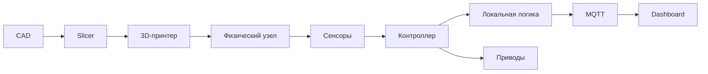
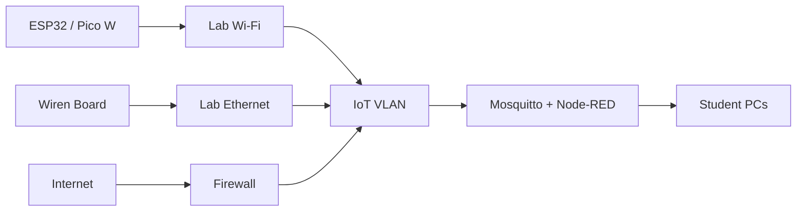

# ENVIRONMENT.md

# Требования к лабораторной среде курса «Современные цифровые технологии»

**Направление:** 44.03.05 «Педагогическое образование (с двумя профилями подготовки)»  
**Профиль:** «Информатика и дополнительное образование (робототехника)»  
**Назначение:** регламент оснащения лабораторных рабочих мест для выполнения практикума по цифровым двойникам, IoT, CAD/3D-печати и цифровым образовательным технологиям.  
**Актуализация:** 27.08.2026.

---

## 0. Общие принципы оснащения

Лабораторное рабочее место должно обеспечивать полный сквозной цикл:



Курс должен сохранять работоспособность при отсутствии внешних облачных сервисов. Базовая инфраструктура разворачивается локально:

- Python;
- Git;
- MQTT;
- Node-RED;
- CAD;
- slicer;
- Webots;
- локальные датчики и исполнительные механизмы.

Приоритет при оснащении:

1. отечественное ПО и оборудование — если оно соответствует учебной задаче;
2. Open Source — для воспроизводимости и независимости от внешнего облака;
3. зарубежные бесплатные продукты — как совместимые дополнительные средства, а не единственная точка отказа.

---

# 1. Аппаратный комплекс

## 1.1. Рабочая станция

### Минимальная конфигурация

| Компонент | Минимум |
|---|---|
| CPU | x86-64, 4 ядра |
| ОЗУ | 8 ГБ |
| SSD | 30 ГБ свободного пространства |
| USB | не менее 2 свободных портов |
| Сеть | Ethernet или Wi-Fi |
| Монитор | Full HD рекомендуется |
| ОС | Astra Linux / Альт / Ubuntu 22.04 LTS |

### Рекомендуемая конфигурация

| Компонент | Рекомендация |
|---|---|
| CPU | 6–8 ядер |
| ОЗУ | 16 ГБ |
| SSD | 60 ГБ свободного пространства |
| Сеть | Gigabit Ethernet + Wi-Fi |
| USB | 4 и более |
| GPU | не обязателен; полезен для Webots и CAD |
| Второй монитор | желателен на преподавательском месте |

Для компьютерного класса рекомендуется **16 ГБ ОЗУ**: одновременно могут работать IDE, браузер, Webots, CAD, Docker/Podman и Node-RED.

---

## 1.2. Микроконтроллеры и учебные платформы

### ESP32

Рекомендуемый базовый контроллер лабораторных работ по IoT:

- Wi-Fi;
- BLE;
- GPIO;
- ADC;
- PWM;
- UART;
- SPI;
- I²C.

Подходит для:

- MQTT;
- сенсорной телеметрии;
- локальной автоматики;
- управления приводами через внешние драйверы.

### RP2040

Для автономных лабораторных работ:

- Raspberry Pi Pico;
- совместимые платы RP2040.

Для MQTT без внешнего сетевого модуля следует использовать:

- **Raspberry Pi Pico W/WH**;
- либо другую RP2040-плату со встроенным Wi-Fi.

Сам RP2040 не предоставляет Wi-Fi.

### РОББО

Допускается использование учебных платформ РОББО для:

- программирования;
- робототехники;
- цифрового производства;
- работы с датчиками и исполнительными механизмами.

РОББО целесообразно применять там, где комплект уже входит в оснащение лаборатории и обеспечивает единый учебный набор.

### MGBot

Рекомендуется для сценариев:

- «Интернет вещей в образовании»;
- ESP32/«ЙоТик»;
- умная инфраструктура;
- мобильная робототехника;
- сенсорные лаборатории.

### Wiren Board

Используется как более инженерный уровень IoT/Edge:

- Linux-контроллер;
- Ethernet/Wi-Fi в зависимости от модели;
- RS-485;
- Modbus RTU/TCP;
- MQTT;
- локальные правила автоматизации;
- web-dashboard.

Wiren Board особенно полезен при переходе от школьного микроконтроллерного проекта к архитектуре промышленной автоматизации.

---

## 1.3. Рекомендуемая комплектация на одно рабочее место

| Компонент | Количество |
|---|---:|
| ESP32 DevKit | 1 |
| Pico W/WH | 1 |
| Breadboard | 1–2 |
| USB-кабели | 2 |
| Набор резисторов | 1 |
| Набор проводов Dupont | 1 |
| Мультиметр | 1 на 1–2 места |
| Лабораторный БП с ограничением тока | 1 на 2–4 места |
| Драйвер DC-моторов | 1 |
| Драйвер шагового двигателя | 1 |
| SG90 | 1–2 |
| MG996R | 1 |
| DC-мотор с редуктором | 2 |
| Шаговый двигатель | 1 |

---

## 1.4. Сенсоры

Базовый набор:

| Категория | Рекомендуемые устройства |
|---|---|
| Климат | BME280 / SHT3x / DHT22 |
| Освещенность | BH1750, фоторезистор |
| Расстояние | HC-SR04 или совместимый; ToF VL53L0X/VL53L1X |
| IMU | MPU6050 или современный совместимый 6DoF-модуль |
| Ток/напряжение | INA219 / INA226 |
| Линия | массив ИК-датчиков 5–8 каналов |
| Сила | FSR или тензодатчик + АЦП |
| Положение | энкодеры, концевики |
| Присутствие | PIR / ИК-барьер |

В учебном классе рекомендуется унифицировать разъемы и питание модулей, чтобы уменьшить число ошибок подключения.

---

## 1.5. Драйверы двигателей

### L298N

Допускается как **учебный** двухканальный H-мост для маломощных DC-моторов.

Ограничения:

- заметное падение напряжения;
- низкая эффективность относительно современных MOSFET-драйверов;
- нагрев.

Для новых стендов предпочтителен современный MOSFET H-bridge подходящего тока.

### TMC2209

Используется для **биполярных шаговых двигателей**.

Не предназначен как замена H-мосту управления обычным DC-мотором.

При настройке необходимо проверить:

- ток двигателя;
- микрошаг;
- охлаждение;
- напряжение питания;
- направление подключения обмоток.

---

## 1.6. Сервоприводы

### SG90

Подходит для:

- малых рычагов;
- панорамных датчиков;
- учебных захватов без большой нагрузки.

### MG996R

Подходит для более нагруженных учебных механизмов, но требует отдельного источника питания.

### Правило питания

**Запрещается рассчитывать питание группы сервоприводов от вывода 5 V/3.3 V микроконтроллерной платы.**

Используйте:

```text
внешний источник питания сервоприводов
+
общая GND с микроконтроллером
```

Источник должен иметь запас по пиковому току.

---

# 2. Аддитивный парк

## 2.1. Приоритетная конфигурация

На лабораторию/группу рекомендуется:

- 2–4 FDM/FFF-принтера;
- минимум один отечественный принтер;
- отдельная зона печати;
- шкаф/контейнер для сухого хранения филамента;
- вытяжка или организованная вентиляция;
- комплект штангенциркулей.

---

## 2.2. FDM/FFF-принтеры

### PICASO 3D Designer

Допускаются актуальные модели семейства Designer.

Например, Designer X использует технологию FFF, работает с филаментом 1.75 мм и поддерживает PLA, PETG, ABS, TPU и ряд инженерных материалов.

Для оборудования PICASO следует рассматривать фирменный slicer **Polygon X** как основной профиль производителя.

### IMPRINTA Hercules

Рекомендуется ориентироваться на актуальную линейку Hercules G Series, а не на снятые с производства ранние модели.

Допускаются:

- Hercules G3;
- Hercules G4 / G4 Duo;
- Hercules G6 / G6 Duo;
- иные актуальные модели производителя.

Для оборудования IMPRINTA допускается фирменное ПО производителя либо проверенный профиль Cura/PrusaSlicer.

### Creality Ender-3

Ender-3 может использоваться как бюджетная учебная FDM-платформа, если уже имеется в оснащении.

Это **не отечественное оборудование**, поэтому при закупке нового парка в рамках политики импортонезависимости приоритет следует отдавать российским решениям, если они удовлетворяют требованиям курса.

---

## 2.3. Фотополимерные установки SLA/MSLA

Допускаются только при наличии:

- отдельной технологической зоны;
- вентиляции;
- СИЗ;
- промывочной станции;
- станции финальной UV-засветки;
- безопасного хранения фотополимера;
- установленного порядка обращения с отходами.

Для базового школьного/педагогического практикума FDM/FFF является предпочтительным вариантом.

---

## 2.4. Филаменты

### PLA

Рекомендуемый материал для большинства учебных работ:

- прост в печати;
- умеренная температура;
- низкая усадка;
- удобен для прототипов.

### PETG

Подходит для функциональных деталей:

- выше ударная вязкость;
- выше теплостойкость относительно типового PLA;
- полезен для кронштейнов и корпусов.

### ABS

Использовать только при наличии оборудования и вентиляции:

- выше температура печати;
- склонность к короблению;
- требовательность к закрытой/стабильной камере;
- повышенные требования к организации воздухообмена.

---

# 3. Программное обеспечение

## 3.1. Операционные системы

### Приоритет

1. **ОС Альт Образование 11.2** — рекомендуется для новых образовательных рабочих мест.
2. **Astra Linux** — в соответствии с имеющейся лицензией и поддерживаемой редакцией.
3. Ubuntu 22.04 LTS — Open Source резерв/универсальная среда.

### Astra Linux Common Edition

Если лаборатория уже использует Astra Linux Common Edition «Орел» 2.12, ее можно сохранить для совместимых учебных задач.

При новом развертывании следует проверить актуальный статус поддержки и лицензирования у производителя и по возможности использовать поддерживаемую редакцию Astra Linux.

> Не следует проектировать новое оснащение исключительно вокруг старой Common Edition без проверки жизненного цикла продукта.

### Альт Образование

На 27.08.2026 актуальна **Альт Образование 11.2** для x86-64 и aarch64.

Она является предпочтительным базовым вариантом курса благодаря образовательной направленности и отечественному происхождению.

---

## 3.2. CAD

### КОМПАС-3D

Требование пользователя курса сохраняет совместимость с:

- v21;
- v22;
- v23.

Однако в 2026 г. актуальна уже **КОМПАС-3D v25**, включая пакеты для Linux.

Поэтому:

```text
существующий класс: v21–v23 допускаются;
новое развертывание: v25 рекомендуется;
формат отчета: обязательно указать фактическую версию.
```

Используйте только учебную/образовательную лицензию в соответствии с условиями АСКОН.

### FreeCAD

Open Source резерв для параметрического моделирования.

На 27.08.2026 актуальная стабильная линия — **FreeCAD 1.1.x**.

Рекомендуется для:

- работы на Linux;
- домашних заданий;
- независимого воспроизведения модели;
- случаев отсутствия лицензии КОМПАС-3D.

---

## 3.3. Слайсеры

### Ultimaker Cura

Open Source slicer для FDM.

Использовать:

- с профилем конкретного принтера;
- после проверки размера стола;
- диаметра сопла;
- ограничений температур;
- start/end G-code.

### PrusaSlicer

Open Source slicer.

Использование с PICASO/Hercules допускается **только с проверенным преподавателем профилем**.

Наличие похожего принтера в списке не означает корректность профиля.

### Приоритет профилей

```text
официальный slicer производителя
        ↓
официальный профиль производителя
        ↓
проверенный кафедрой Cura/PrusaSlicer profile
        ↓
ручной профиль после валидации
```

---

## 3.4. Среды разработки

### VS Code / VSCodium + PlatformIO

Рекомендуется для:

- ESP32;
- Arduino framework;
- C/C++;
- Git;
- Serial monitor;
- сложных проектов.

### Arduino IDE 2.x

Рекомендуется как простой вход для:

- ESP32;
- Arduino-compatible boards;
- библиотечных примеров.

### Thonny IDE

Рекомендуется для:

- MicroPython;
- ESP32;
- Pico W;
- первых занятий.

---

## 3.5. Python

Минимум:

```text
Python 3.10+
```

Рекомендуется:

```text
Python 3.11
```

Проверка:

```bash
python3 --version
```

---

## 3.6. IoT-сервисы

### Eclipse Mosquitto

Используется как локальный MQTT broker.

Поддерживает MQTT:

- 5.0;
- 3.1.1;
- 3.1.

### Node-RED

Используется для:

- подписки на MQTT;
- преобразования JSON;
- dashboard;
- правил;
- прототипирования интеграций.

### Python

Основные библиотеки:

- `paho-mqtt`;
- `pydantic`;
- `numpy`;
- `matplotlib`;
- `pandas`;
- `pyserial`.

---

## 3.7. Виртуальные симуляторы

### Webots

Основной виртуальный робототехнический симулятор.

Применяется для:

- differential drive;
- сенсоров;
- манипуляторов;
- алгоритмов управления;
- sim-to-real экспериментов.

Желательно установить локально до начала занятий.

### Tinkercad Circuits

Используется как **дополнительный** браузерный инструмент:

- Arduino;
- электрические схемы;
- простые датчики;
- моделирование кода.

Так как сервис внешний и облачный, обязательная часть курса должна иметь резервный локальный сценарий.

---

# 4. Python-окружение

## 4.1. `requirements.txt`

Полный базовый листинг:

```text
paho-mqtt>=2.1,<3
pydantic>=2.8,<3
numpy>=2.0,<3
matplotlib>=3.9,<4
pandas>=2.2,<3
pyserial>=3.5,<4
requests>=2.32,<3
python-dotenv>=1.0,<2
pytest>=8.3,<9
jupyterlab>=4.2,<5
```

Фактический файл должен находиться в корне репозитория.

---

## 4.2. Создание `venv`

```bash
python3 -m venv .venv
source .venv/bin/activate

python -m pip install --upgrade pip
pip install -r requirements.txt
```

Проверка:

```bash
pip check
python check_environment.py
```

---

# 5. Контейнерная IoT-инфраструктура

## 5.1. Назначение

Контейнеры позволяют преподавателю поднять сервер группы:

```text
Mosquitto :1883
Node-RED  :1880
```

Актуальные на дату документа контейнерные линии:

- Eclipse Mosquitto 2.1.x;
- Node-RED 4.1.x.

В репозитории версии фиксируются, чтобы инфраструктура не менялась во время семестра.

---

## 5.2. Структура

```text
infra/
├── docker-compose.yml
└── mosquitto/
    └── config/
        └── mosquitto.conf
```

---

## 5.3. `docker-compose.yml`

```yaml
name: sdt-iot-lab

services:
  mosquitto:
    image: eclipse-mosquitto:2.1.2-alpine
    container_name: sdt-mosquitto
    restart: unless-stopped
    ports:
      - "1883:1883"
    volumes:
      - ./mosquitto/config:/mosquitto/config:ro
      - mosquitto_data:/mosquitto/data
      - mosquitto_log:/mosquitto/log
    networks:
      - sdt_iot

  nodered:
    image: nodered/node-red:4.1.13-22
    container_name: sdt-nodered
    restart: unless-stopped
    depends_on:
      - mosquitto
    ports:
      - "1880:1880"
    environment:
      - TZ=Europe/Moscow
    volumes:
      - nodered_data:/data
    networks:
      - sdt_iot

networks:
  sdt_iot:
    driver: bridge

volumes:
  mosquitto_data:
  mosquitto_log:
  nodered_data:
```

Современный Compose использует Compose Specification; поле `version:` не требуется.

---

## 5.4. `mosquitto.conf`

Учебная конфигурация для **изолированной локальной сети**:

```conf
persistence true
persistence_location /mosquitto/data/
log_dest stdout

listener 1883 0.0.0.0

allow_anonymous true
```

### Критическое ограничение

`allow_anonymous true` разрешается только:

- в изолированной лабораторной VLAN;
- при отсутствии маршрутизации из Интернета;
- на временном учебном стенде.

Для общей сети:

```text
allow_anonymous false
password_file ...
ACL
TLS
```

обязательны в соответствии с локальной политикой ИБ.

---

## 5.5. Запуск

Из каталога `infra/`:

```bash
docker compose up -d
```

Проверка:

```bash
docker compose ps
```

Логи:

```bash
docker compose logs -f mosquitto
```

Node-RED:

```text
http://localhost:1880
```

Проверка MQTT в двух терминалах:

```bash
mosquitto_sub \
  -h localhost \
  -t 'course/#' \
  -v
```

```bash
mosquitto_pub \
  -h localhost \
  -t course/test/value \
  -m '{"value":42}'
```

Остановка:

```bash
docker compose down
```

Удаление вместе с данными:

```bash
docker compose down -v
```

Последняя команда удаляет сохраненные flows/данные и используется только осознанно.

---

## 5.6. Docker или Podman

На отечественных Linux-системах допускается:

- Docker Engine;
- Podman;
- совместимая реализация Compose.

Перед семестром администратор должен проверить конкретную схему установки для выбранной ОС.

Контейнеры не должны требовать `--privileged`, если это не обосновано отдельной лабораторной задачей.

---

# 6. Сетевая архитектура класса

Рекомендуется отдельная учебная VLAN:



Минимальные правила:

- не публиковать MQTT/Node-RED напрямую в Интернет;
- IoT-устройства не должны иметь доступ к административной сети вуза;
- сервер группы имеет статический адрес/DNS-имя;
- Wi-Fi пароль не хранится в публичном Git;
- преподаватель документирует topics и правила доступа.

---

# 7. Регламент техники безопасности

> Этот раздел является учебным регламентом курса и **не заменяет** локальные инструкции по охране труда, пожарной безопасности, паспорта оборудования, инструкции производителя и распорядительные документы образовательной организации.

## 7.1. Нормативная основа

При организации лаборатории учитываются, в частности:

- **ГОСТ 12.1.019-2017** — электробезопасность, общие требования и виды защиты;
- **ГОСТ 12.2.007.0-75** — общие требования безопасности электротехнических изделий;
- **ГОСТ 12.3.002-2014** — общие требования безопасности производственных процессов;
- **ГОСТ 12.1.004-91** — пожарная безопасность, общие требования;
- **ГОСТ 12.1.005-88** — санитарно-гигиенические требования к воздуху рабочей зоны;
- санитарные правила для образовательных организаций.

### Переход нормативов в 2026 г.

На дату документа СП 2.4.3648-20 действует до **31 августа 2026 г.**.

С **1 сентября 2026 г.** вступает в силу:

**СП 2.4.2.4283-26 «Санитарно-эпидемиологические требования к организациям воспитания и обучения, отдыха и оздоровления детей и молодежи».**

Следовательно, для осеннего семестра 2026/2027 при организации работы со школьниками и молодежью следует ориентироваться уже на новый СП.

---

## 7.2. Общий порядок допуска

Студент допускается к аппаратной части после:

1. вводного инструктажа;
2. ознакомления с рабочим местом;
3. проверки преподавателем схемы;
4. понимания расположения аварийного отключения;
5. проверки отсутствия короткого замыкания;
6. разрешения преподавателя на включение питания.

Нельзя включать неизвестную или измененную схему без проверки.

---

## 7.3. Электробезопасность

### Учебная низковольтная часть

При самостоятельной сборке студентами предпочтительно использовать:

```text
3.3 V
5 V
12 V
24 V
```

через безопасные сертифицированные источники и лабораторные БП.

### Сетевое напряжение

Работы с открытыми цепями сетевого напряжения 230 В в обычной студенческой лабораторной работе **не выполняются**.

Подключение, ремонт и вскрытие сетевой части:

- 3D-принтера;
- блока питания;
- паяльной станции;
- другого оборудования

выполняет только уполномоченный персонал.

### Перед изменением схемы

```text
STOP
→ отключить питание
→ убедиться в отсутствии движения
→ изменить соединение
→ визуально проверить
→ включить ограничение тока
→ только затем подать питание
```

---

## 7.4. Двигатели и механизмы

Перед запуском:

- робот устанавливается так, чтобы не упасть со стола;
- колеса при первой проверке желательно вывесить;
- зона вращения манипулятора освобождается;
- кабели фиксируются;
- предусмотрена программная/физическая остановка.

Запрещается:

- удерживать рукой вращающийся вал;
- касаться шестерен во время движения;
- блокировать сервопривод в крайнем положении длительное время;
- использовать неподходящий блок питания.

---

## 7.5. Паяльные станции

Обязательные меры:

- термостойкий коврик;
- устойчивый держатель паяльника;
- локальная вытяжка дыма;
- защитные очки при обрезке выводов;
- уборка обрезков;
- выключение станции после работы.

Запрещается:

- оставлять паяльник без держателя;
- касаться жала;
- паять рядом с легковоспламеняющимися материалами;
- принимать пищу на рабочем месте;
- работать без вентиляции.

После пайки руки моют; правила обращения с конкретным припоем и флюсом определяются их паспортами безопасности.

---

## 7.6. FDM/FFF 3D-принтеры

Опасные зоны:

- hotend;
- нагретый стол;
- движущиеся оси;
- вентиляторы;
- силовой блок.

### Перед печатью

Проверить:

- исправность кабелей;
- отсутствие посторонних предметов;
- закрепление стола;
- корректность профиля;
- допустимые температуры;
- соответствие материала.

### Во время печати

Не допускается:

- касаться hotend/стола;
- просовывать руки в рабочую зону;
- снимать застрявший материал на движущемся принтере;
- оставлять экспериментальную печать без установленного регламента контроля.

### PLA/PETG/ABS

Даже при печати PLA/PETG необходим организованный воздухообмен.

ABS использовать только при достаточной вентиляции/закрытом оборудовании и с учетом инструкции производителя материала и принтера.

---

## 7.7. SLA/MSLA и фотополимеры

Фотополимер рассматривается как химический материал.

Обязательно:

- нитриловые перчатки;
- защитные очки;
- отдельная технологическая зона;
- исключение контакта жидкой смолы с кожей;
- промывка по инструкции производителя;
- UV post-cure;
- маркированные емкости;
- утилизация по установленному в организации порядку.

Неотвержденный фотополимер и загрязненные им материалы нельзя передавать учащимся без контроля преподавателя.

---

## 7.8. Филамент и механическая обработка

При удалении supports и обработке деталей:

- защитные очки;
- инструмент исправен;
- рез выполнять от себя;
- деталь фиксировать;
- не использовать вращающийся инструмент без отдельного допуска.

---

## 7.9. Литиевые аккумуляторы

Для мобильных роботов использовать:

- готовые защищенные аккумуляторные сборки;
- штатное зарядное устройство;
- BMS/защиту, если это предусмотрено конструкцией.

В базовых работах запрещается:

- пайка непосредственно к незащищенным Li-ion элементам студентами без специального оборудования и допуска;
- заряд неизвестным источником;
- использование вздутого/поврежденного аккумулятора;
- короткое замыкание.

Поврежденный аккумулятор немедленно выводится из эксплуатации.

---

## 7.10. Пожарная безопасность

В лаборатории:

- не загромождаются проходы;
- доступ к отключению электропитания свободен;
- средства пожаротушения доступны согласно плану объекта;
- горючие материалы не хранятся рядом с hotend, паяльной станцией и нагревателями;
- неисправное оборудование не эксплуатируется.

При запахе горения, дыме, искрении:

```text
1. остановить работу;
2. безопасно отключить питание;
3. сообщить преподавателю;
4. действовать по локальной инструкции пожарной безопасности.
```

---

## 7.11. Аварийная остановка

Для роботизированного комплекса рекомендуется:

- аппаратный E-STOP на крупных стендах;
- программный `FAULT/LOCKOUT`;
- автоматический zero-output при потере связи;
- watchdog.

Принцип:

$$
\text{неопределенное состояние}
\rightarrow
\text{безопасное состояние}.
$$

---

# 8. Проверка лаборатории перед семестром

## Преподаватель / инженер

- [ ] Рабочие станции загружаются.
- [ ] Доступен Python 3.10+.
- [ ] Git работает.
- [ ] Docker/Podman Compose запускается.
- [ ] Mosquitto принимает тестовое сообщение.
- [ ] Node-RED доступен.
- [ ] ESP32 прошивается.
- [ ] Pico W подключается к Wi-Fi.
- [ ] Webots запускается.
- [ ] КОМПАС-3D/FreeCAD запускается.
- [ ] Slicer имеет проверенные профили принтеров.
- [ ] 3D-принтеры обслужены.
- [ ] Вентиляция исправна.
- [ ] Паяльные станции исправны.
- [ ] Блоки питания имеют ограничение тока.
- [ ] Мультиметры исправны.
- [ ] Аккумуляторы осмотрены.
- [ ] Аварийное отключение доступно.
- [ ] Инструкции по охране труда актуализированы под СП, действующий с 01.09.2026.

---

# 9. Проверка рабочего места студентом

Перед каждой аппаратной лабораторной:

- [ ] Вариант задания определен.
- [ ] Схема нарисована.
- [ ] Напряжения модулей совместимы.
- [ ] Питание отключено во время сборки.
- [ ] Двигатели питаются через драйвер.
- [ ] Сервоприводы имеют подходящий источник питания.
- [ ] Общая GND организована корректно.
- [ ] Установлено ограничение тока.
- [ ] Git-репозиторий создан.
- [ ] Секреты отсутствуют в Git.
- [ ] Рабочая зона свободна.

---

# 10. Рекомендуемая структура репозитория инфраструктуры

```text
course-environment/
├── ENVIRONMENT.md
├── requirements.txt
├── check_environment.py
└── infra/
    ├── docker-compose.yml
    ├── .env.example
    └── mosquitto/
        └── config/
            └── mosquitto.conf
```

---

# 11. Официальные ресурсы для проверки актуальности

Перед началом каждого учебного года рекомендуется проверить:

- Astra Linux: <https://astra.ru/>
- Альт Образование: <https://www.basealt.ru/alt-education/>
- КОМПАС-3D: <https://ascon.ru/products/kompas-3d/>
- FreeCAD: <https://www.freecad.org/>
- Wiren Board: <https://wirenboard.com/>
- РОББО: <https://robbo.ru/>
- MGBot: <https://mgbot.ru/>
- PICASO 3D: <https://www.picaso-3d.com/>
- IMPRINTA: <https://imprinta.ru/>
- Eclipse Mosquitto: <https://mosquitto.org/>
- Node-RED: <https://nodered.org/>
- Webots: <https://cyberbotics.com/>
- Docker Compose Specification: <https://docs.docker.com/compose/compose-file/>
- Фонд стандартов Росстандарта: <https://protect.gost.ru/>
- Роспотребнадзор: <https://rospotrebnadzor.ru/>

---

# 12. Ключевой принцип курса

Лаборатория должна быть построена так, чтобы студент мог пройти инженерный цикл:

```text
сформулировать требования
→ собрать низковольтную схему
→ написать алгоритм
→ передать телеметрию
→ визуализировать данные
→ спроектировать CAD-узел
→ подготовить производство
→ безопасно испытать
→ зафиксировать данные
→ воспроизвести результат из Git
```

Работоспособность, безопасность и воспроизводимость имеют приоритет над демонстрационным эффектом.
