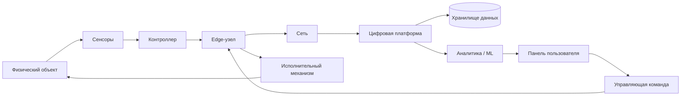
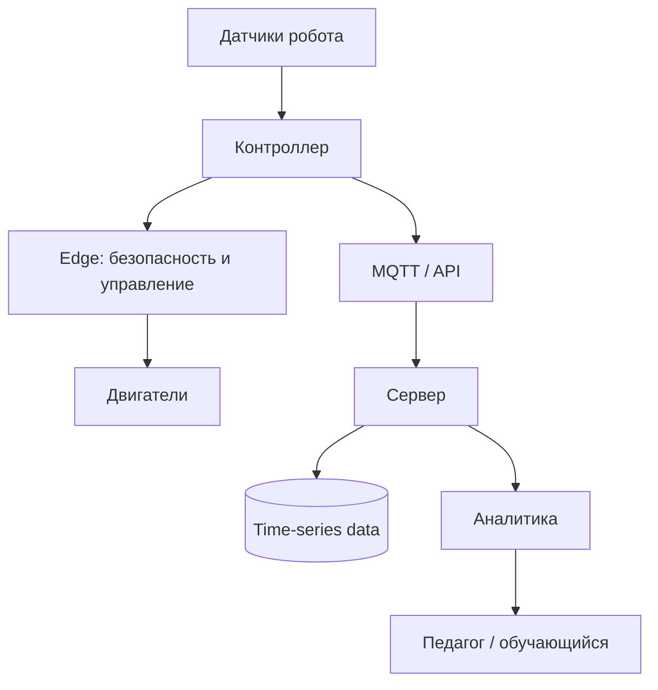
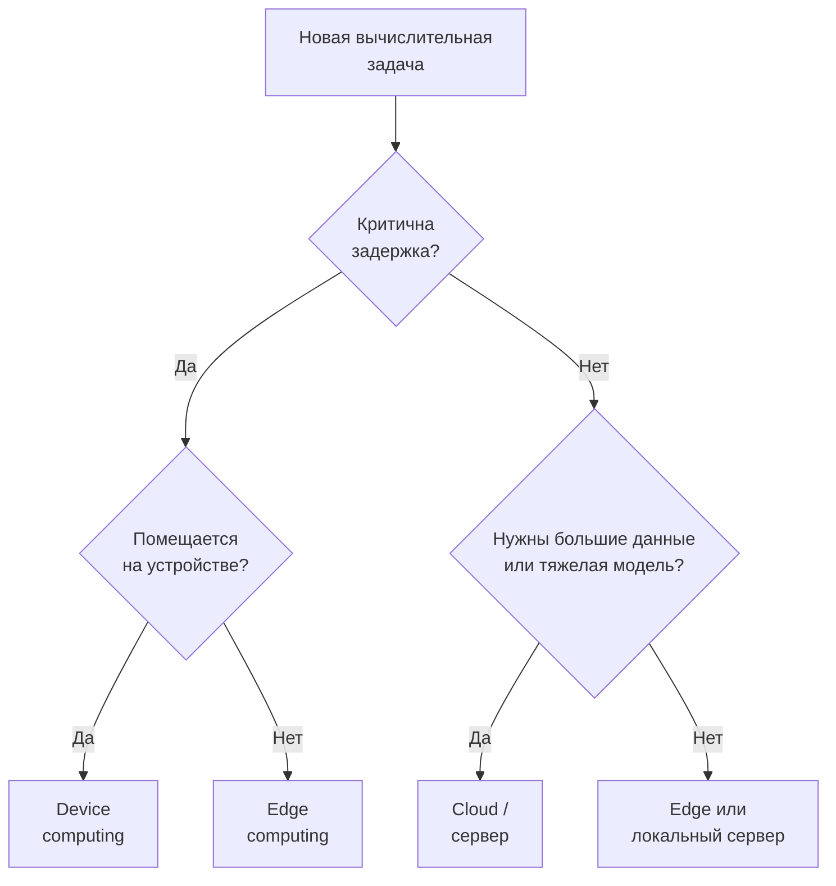
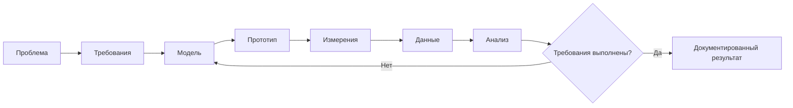

# Дисциплина: Современные цифровые технологии

## Лекция: Раздел 1. Цифровые технологии

> **Дисциплина:** «Современные цифровые технологии»  
> **Направление:** 44.03.05 «Педагогическое образование (с двумя профилями подготовки)»  
> **Профиль:** «Информатика и дополнительное образование (робототехника)»  
> **Образовательная организация:** ГАОУ ВО МГПУ  
> **Формат:** GitHub Flavored Markdown  
> **Актуализация:** август 2026 г.


### 1. Аннотация темы и формируемые компетенции (ОПК-2, ОПК-9, УК-1, УК-6)

Раздел формирует целостное инженерное представление о цифровой технологии не как об отдельной программе или устройстве, а как о **системе преобразования физических процессов в данные, вычислительные модели и управляющие воздействия**. Центральная линия лекции — связь сенсорики, вычислительных сетей, Edge Computing, облачной инфраструктуры, киберфизических систем, цифровых двойников и программно-аппаратных платформ с задачами школьной информатики и образовательной робототехники.

После изучения темы студент должен уметь:

- различать **оцифровку**, **цифровизацию** и **цифровую трансформацию**;
- описывать жизненный цикл данных от датчика до аналитического решения;
- проектировать простую архитектуру `sensor → edge → network → platform → application`;
- объяснять роль Edge Computing и облачных вычислений;
- оценивать задержку, доступность и пропускную способность цифровой системы;
- связывать цифровые технологии с киберфизическими системами и робототехникой;
- выбирать отечественное системное и прикладное ПО для учебной инфраструктуры;
- проектировать учебные задания, в которых цифровая технология выступает объектом исследования, а не только готовым инструментом.

Формируемые компетенции:

- **ОПК-2** — проектирование учебной деятельности с учетом современных цифровых технологий;
- **ОПК-9** — применение ИКТ и цифровых инструментов в образовательной и профессиональной деятельности;
- **УК-1** — системный и критический анализ архитектуры, данных, ограничений и рисков;
- **УК-6** — самоорганизация при освоении быстро меняющегося технологического стека, документирование и воспроизводимость проекта.

### 2. Фундаментальный и прикладной инженерный базис

#### 2.1. От цифрового сигнала к цифровой системе

**Оцифровка (digitization)** — преобразование аналогового представления в цифровое. Например, датчик температуры преобразует физическую величину в электрический сигнал, а АЦП — в числовое значение.

Если диапазон АЦП равен $0 \ldots V_{ref}$, а разрядность составляет $n$ бит, шаг квантования приближенно равен:

$$
\Delta V = \frac{V_{ref}}{2^n - 1}.
$$

Для 12-битного АЦП и $V_{ref}=3.3$ В:

$$
\Delta V \approx \frac{3.3}{4095} \approx 0.806 \text{ мВ}.
$$

**Цифровизация (digitalization)** — использование цифровых данных для изменения процесса. Например, температура в кабинете автоматически регистрируется и отображается в панели мониторинга.

**Цифровая трансформация** — изменение организационной модели на основе данных и цифровых технологий. Например, инженерная лаборатория не просто хранит измерения, а автоматически управляет климатом, ведет журнал экспериментов, формирует уведомления и позволяет учащимся анализировать данные.

#### 2.2. Сквозная цифровая технология

Сквозная технология проходит через несколько предметных и технологических уровней:

| Уровень | Пример |
|---|---|
| Физический объект | мобильный робот, теплица, 3D-принтер |
| Сенсоры | температура, расстояние, ток, камера |
| Контроллер | микроконтроллер, ПЛК, SBC |
| Связь | Wi-Fi, Ethernet, RS-485, BLE |
| Протокол | MQTT, CoAP, HTTP, Modbus |
| Edge | локальная фильтрация, правила, inference |
| Платформа | база данных, брокер, API |
| Аналитика | статистика, ML, визуализация |
| Пользовательский сервис | панель педагога, цифровой двойник, учебное приложение |

#### 2.3. Киберфизическая система

Киберфизическая система (CPS) замыкает контур:

$$
\text{физический процесс}
\rightarrow
\text{измерение}
\rightarrow
\text{вычисление}
\rightarrow
\text{решение}
\rightarrow
\text{воздействие}.
$$

Пример — мобильный робот:

1. датчик измеряет расстояние;
2. контроллер фильтрует измерение;
3. алгоритм принимает решение;
4. драйвер двигателя меняет скорость;
5. физическая система изменяет состояние;
6. цикл повторяется.

#### 2.4. Edge Computing

**Edge Computing** переносит часть вычислений ближе к источнику данных.

Если полная задержка cloud-first архитектуры приблизительно равна

$$
T_{cloud} =
T_{sense} + T_{uplink} + T_{queue} + T_{compute} + T_{downlink},
$$

то для edge-сценария:

$$
T_{edge} =
T_{sense} + T_{local} + T_{actuate}.
$$

Для аварийной остановки робота локальная обработка предпочтительнее: решение не должно зависеть от качества интернет-канала.

#### 2.5. Edge, Fog и Cloud

| Подход | Где вычисляем | Сильная сторона | Ограничение |
|---|---|---|---|
| Device | на микроконтроллере | минимальная задержка | мало RAM/CPU |
| Edge | на локальном шлюзе | быстрый локальный анализ | ограниченный ресурс |
| Fog | на промежуточных узлах | распределенная координация | сложнее управление |
| Cloud | в ЦОД | масштабирование и аналитика | сеть, задержка, передача данных |

Для образовательной робототехники полезна гибридная схема: безопасное управление выполняется локально, а хранение истории и аналитика — на сервере.

#### 2.6. Пропускная способность потока данных

Если $N$ устройств отправляют пакет размером $S$ байт с частотой $f$ Гц, идеализированная полезная нагрузка:

$$
R = N \cdot S \cdot f \cdot 8
$$

бит/с.

Для 30 датчиков, сообщения 100 байт и частоты 2 Гц:

$$
R = 30 \cdot 100 \cdot 2 \cdot 8 = 48\,000 \text{ бит/с}.
$$

Реальная нагрузка выше из-за заголовков протоколов, подтверждений и служебного трафика.

#### 2.7. Надежность и доступность

Для цифровой лаборатории полезна базовая модель:

$$
A = \frac{MTBF}{MTBF + MTTR},
$$

где $MTBF$ — среднее время между отказами, а $MTTR$ — среднее время восстановления.

Высокая доступность не тождественна безопасности: система может быть доступной, но неправильно защищенной.

#### 2.8. Цифровой двойник

**Цифровой двойник** — вычислительное представление объекта или процесса, связанное с реальными или моделируемыми данными.

Для учебного робота минимальный двойник может содержать:

```json
{
  "robot_id": "r01",
  "pose": {"x": 1.25, "y": 0.80, "theta": 1.57},
  "battery": 78,
  "distance_front_cm": 24.3,
  "motor_left": 0.42,
  "motor_right": 0.39,
  "timestamp": "2026-08-27T12:00:00Z"
}
```

Цифровой двойник дает студенту возможность видеть связь между **моделью данных** и физическим поведением устройства.

#### 2.9. Минимальная edge-фильтрация на Python

```python
from collections import deque
from statistics import mean

window = deque(maxlen=5)

def edge_filter(value: float) -> float:
    window.append(value)
    return mean(window)

measurements = [23.1, 23.3, 31.8, 23.4, 23.2]

for x in measurements:
    print(x, "->", round(edge_filter(x), 2))
```

В реальной системе следует дополнительно рассматривать выбросы, калибровку датчика и доверительный диапазон.

#### 2.10. Отечественный программный контекст

Для учебной инфраструктуры принципиально рассматривать возможность работы на отечественном ПО.

**Astra Linux** применяется в российских организациях и развивает отдельные образовательные программы для вузов, СПО и школ.

**Альт Образование 11.2** позиционируется как отечественная ОС специально для образовательных организаций; в дистрибутив включены программы для программирования, инженерной графики и робототехники.

В инженерной графике и цифровом проектировании:

- **КОМПАС-3D** — отечественная САПР АСКОН;
- **T-FLEX CAD** — отечественная параметрическая CAD-система;
- обе платформы имеют образовательные сценарии и учебные версии/комплекты.

### 3. Архитектурные диаграммы и алгоритмы (Mermaid.js)

#### 3.1. Сквозная архитектура цифровой системы



#### 3.2. Edge-cloud контур для робототехники



#### 3.3. Алгоритм выбора места вычислений



#### 3.4. Жизненный цикл цифрового инженерного проекта



### 4. Дидактический блок: методика интеграции темы в школьный курс информатики и кружки робототехники

#### 4.1. Методическая идея

Ученику недостаточно перечислить «ИИ, IoT, VR, Big Data». Целесообразнее дать **единую инженерную модель**:

> физический мир → данные → алгоритм → сеть → решение → действие.

Она естественно связывает школьные темы: кодирование информации, алгоритмизацию, компьютерные сети, базы данных, моделирование, программирование и информационную безопасность.

#### 4.2. Учебный мини-проект «Цифровой кабинет»

Команда проектирует прототип:

- датчик температуры;
- датчик освещенности;
- контроллер;
- локальное правило;
- журнал данных;
- dashboard.

| Уровень | Учебная задача |
|---|---|
| Базовый | считать и вывести значение датчика |
| Средний | записывать данные и строить график |
| Повышенный | реализовать edge-правило |
| Проектный | добавить MQTT и цифровой двойник |

#### 4.3. Методика «одна система — четыре представления»

Студент-педагог должен научить школьника представлять одну систему:

1. **физически** — устройства и соединения;
2. **алгоритмически** — блок-схема;
3. **информационно** — структура данных;
4. **сетево** — кто с кем обменивается сообщениями.

#### 4.4. Симуляция перед физическим стендом

До подключения реального оборудования допустимо использовать:

- **Webots** — открытый симулятор робототехники;
- **Tinkercad Circuits** — браузерную модель электронных схем и Arduino;
- локальные симуляторы, входящие в конкретную учебную инфраструктуру.

Для российских образовательных организаций внешний облачный сервис следует рассматривать как **дополнительный**, а не единственный способ выполнения задания: должна существовать резервная локальная среда.

#### 4.5. Оценивание проекта

| Критерий | Доля |
|---|---:|
| Корректность архитектуры | 25% |
| Работоспособность алгоритма | 25% |
| Работа с данными | 20% |
| Обоснование edge/cloud | 15% |
| Документирование и рефлексия | 15% |

### 5. Контрольные вопросы и педагогические кейс-ситуации (5 вопросов)

1. Чем принципиально отличается простая автоматизация от киберфизической системы и цифрового двойника?
2. 25 датчиков передают по 120 байт 4 раза в секунду. Оцените полезную битовую нагрузку сети и объясните, почему реальный трафик будет выше.
3. Робот должен аварийно остановиться за 50 мс, но данные также нужны для долгосрочной аналитики. Какие функции следует разместить на устройстве/edge, а какие — на сервере?
4. Как объяснить восьмикласснику разницу между «облачным сервисом» и Edge Computing без потери инженерной точности?
5. Школа переходит на отечественную ОС. Какие критерии необходимо проверить до переноса робототехнической лаборатории на Astra Linux или Альт Образование?

### 6. Список рекомендуемой отечественной литературы (до 10 источников по ГОСТ)

1. Трофимов, В. В. **Цифровые технологии** : учебник для вузов / В. В. Трофимов. — Москва : Юрайт, 2026. — 141 с. — (Высшее образование). — ISBN 978-5-534-21710-0. — URL: https://urait.ru/bcode/582239 (дата обращения: 27.08.2026).
2. Спиридонов, О. Б. **Киберфизические системы** : учебное пособие для вузов / О. Б. Спиридонов, Л. П. Милешко. — Москва : Юрайт, 2026. — 126 с. — (Высшее образование). — ISBN 978-5-534-21310-2.
3. Золкин, А. Л. **Проектирование архитектуры умных городов с применением граничных вычислений** : учебное пособие для вузов / А. Л. Золкин, В. Д. Мунистер, О. С. Гольцева, А. А. Артамонов. — Санкт-Петербург : Лань, 2025. — 152 с. — ISBN 978-5-507-52947-6.
4. Самойлова, Н. А. **Сквозные цифровые технологии в градостроительстве** : учебное пособие / Н. А. Самойлова. — Москва : Ай Пи Ар Медиа, 2025. — 142 с. — ISBN 978-5-4497-4180-6. — DOI 10.23682/148673.
5. Баланов, А. Н. **Автоматизация производства. Разработка и внедрение систем управления** : учебное пособие для вузов / А. Н. Баланов. — Санкт-Петербург : Лань, 2024. — 392 с. — ISBN 978-5-507-49363-0.
6. ГОСТ Р 70924-2023 (ИСО/МЭК 30141:2018). **Информационные технологии. Интернет вещей. Типовая архитектура**. — Москва : Российский институт стандартизации, 2023. — Введ. 2024-01-01.
7. ГОСТ Р 71777-2024 (ИСО/МЭК 20924:2024). **Информационные технологии. Интернет вещей. Термины и определения**. — Москва : Российский институт стандартизации, 2024.
