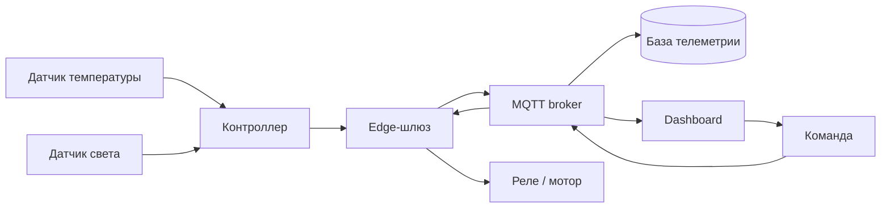
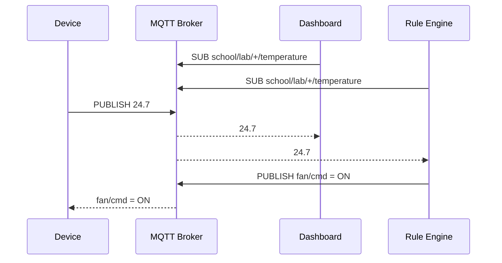
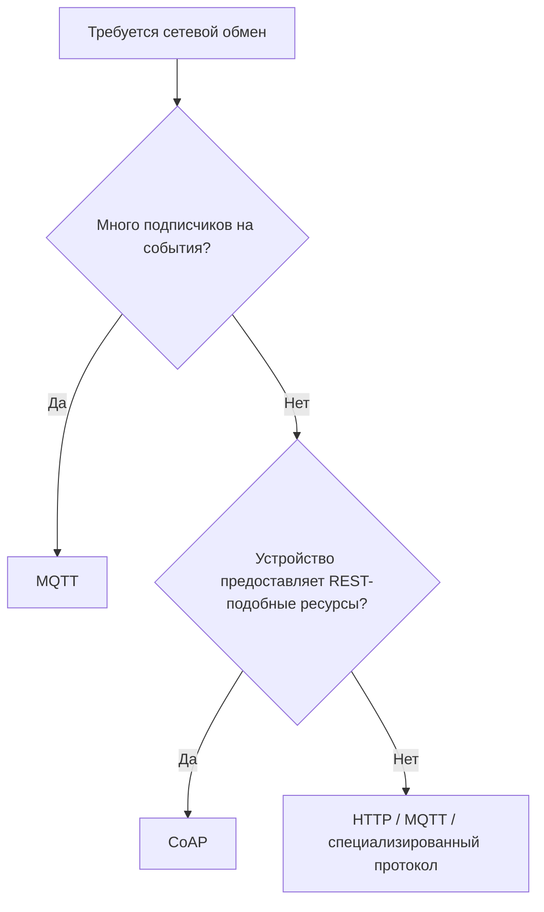
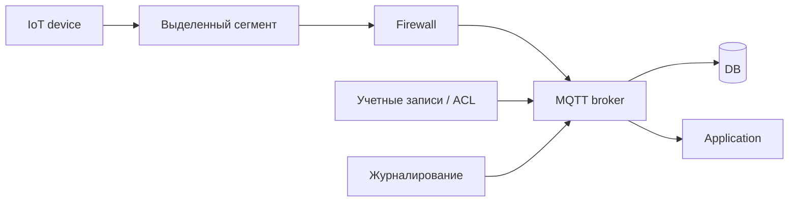

# Дисциплина: Современные цифровые технологии

## Лекция: Раздел 2. Интернет вещей

> **Дисциплина:** «Современные цифровые технологии»  
> **Направление:** 44.03.05 «Педагогическое образование (с двумя профилями подготовки)»  
> **Профиль:** «Информатика и дополнительное образование (робототехника)»  
> **Образовательная организация:** ГАОУ ВО МГПУ  
> **Формат:** GitHub Flavored Markdown  
> **Актуализация:** август 2026 г.


### 1. Аннотация темы и формируемые компетенции (ОПК-2, ОПК-9, УК-1, УК-6)

Раздел посвящен Интернету вещей (IoT) как технологической основе распределенных сенсорных, робототехнических и киберфизических систем. Основной акцент сделан на инженерной архитектуре: датчики, исполнительные механизмы, микроконтроллеры, шлюзы, MQTT/CoAP, Edge Computing, хранение телеметрии и безопасность.

В отечественном контексте рассматриваются **Wiren Board**, образовательные решения **MGBot**, **РОББО**, компоненты «Амперки», а также возможность развертывания серверной части на Astra Linux и ОС семейства «Альт».

После изучения студент должен:

- объяснять отличие IoT от обычного удаленного доступа к устройству;
- проектировать многоуровневую IoT-архитектуру;
- понимать pub/sub-модель MQTT;
- сравнивать MQTT и CoAP;
- оценивать частоту измерений, объем телеметрии и требования к сети;
- проектировать edge-фильтрацию и локальные правила;
- учитывать аутентификацию, шифрование и сегментацию сети;
- переводить инженерную архитектуру в методически корректное школьное задание.

Формируемые компетенции:

- **ОПК-2** — проектирование учебных задач на основе IoT и робототехнических платформ;
- **ОПК-9** — применение сетевых, программных и аппаратных цифровых средств;
- **УК-1** — системный анализ взаимодействия устройств, протоколов, данных и угроз;
- **УК-6** — организация проектной деятельности и воспроизводимой настройки IoT-стенда.

### 2. Фундаментальный и прикладной инженерный базис

#### 2.1. Что делает вещь «вещью Интернета вещей»

Типичная IoT-сущность обладает несколькими признаками:

1. связана с физическим объектом или процессом;
2. имеет идентичность;
3. получает данные или выполняет воздействие;
4. участвует в сетевом взаимодействии;
5. предоставляет сервис или данные другим компонентам.

Простейший датчик температуры без связи — еще не полноценная IoT-система. IoT возникает как **система взаимодействующих устройств, сетей, сервисов и данных**.

ГОСТ Р 70924-2023 закрепляет типовую архитектуру Интернета вещей на национальном уровне.

#### 2.2. Сенсоры и исполнительные механизмы

**Сенсор** переводит физическую величину в измеряемый сигнал.

**Актуатор** осуществляет воздействие: двигатель, реле, клапан, сервопривод, светодиод, нагреватель.

Для `m`-разрядного АЦП код измерения можно приближенно представить как:

```math
\mathrm{code}
=
\mathrm{round}
\left(
\frac{V_{in}}{V_{ref}}
\left(2^m - 1\right)
\right).
```

#### 2.3. Контроллер и шлюз

Контроллер отвечает за:

- опрос датчиков;
- локальную логику;
- управление актуаторами;
- подготовку телеметрии.

Шлюз:

- агрегирует устройства;
- преобразует протоколы;
- выполняет Edge Computing;
- обеспечивает выход в локальную или внешнюю сеть.

Практический отечественный пример — **Wiren Board**. Контроллеры поддерживают, в частности, Modbus RTU/TCP, MQTT, OPC UA и другие промышленные протоколы.

#### 2.4. MQTT

MQTT реализует модель **publish/subscribe**.

Ключевые сущности:

- **publisher** — публикует сообщение;
- **broker** — маршрутизирует сообщения;
- **subscriber** — подписывается на topic;
- **topic** — иерархический адрес сообщения.

Пример:

```text
school/lab1/robot01/distance
school/lab1/robot01/battery
school/greenhouse/temperature
school/greenhouse/fan/cmd
```

#### 2.5. MQTT QoS

| QoS | Семантика | Особенность |
|---:|---|---|
| 0 | at most once | быстро, без подтверждения доставки |
| 1 | at least once | возможны повторы |
| 2 | exactly once на протокольном уровне | сложнее и дороже |

Выбор QoS — инженерный компромисс между надежностью и накладными расходами.

#### 2.6. CoAP

CoAP ориентирован на ограниченные устройства и близок к REST-модели.

| Критерий | MQTT | CoAP |
|---|---|---|
| Модель | publish/subscribe | request/response |
| Центральный broker | обычно нужен | не обязателен |
| Транспорт | TCP | обычно UDP |
| Типичная задача | телеметрия и события | работа с ресурсами устройства |
| Адресация | темы | URI-ресурсы |

#### 2.7. Телеметрия

Пусть измерения выполняются с частотой $f_s$.

Период дискретизации:

$$
T_s = \frac{1}{f_s}.
$$

Если датчик температуры меняется медленно, отправлять 1000 сообщений в секунду бессмысленно. Частота должна соответствовать динамике процесса.

Объем данных за сутки:

$$
V = N \cdot S \cdot f \cdot 86400,
$$

где $N$ — число устройств, $S$ — размер полезного сообщения, $f$ — сообщений в секунду.

#### 2.8. Edge-фильтрация

Устройство не обязано отправлять каждое измерение.

```python
THRESHOLD = 0.5
last_sent = None

def should_publish(value: float) -> bool:
    global last_sent

    if last_sent is None:
        last_sent = value
        return True

    if abs(value - last_sent) >= THRESHOLD:
        last_sent = value
        return True

    return False
```

Это уменьшает трафик, но меняет семантику данных: в хранилище теперь находятся события изменения, а не равномерный временной ряд.

#### 2.9. MQTT на Python

```python
# pip install paho-mqtt

import json
import time
import paho.mqtt.client as mqtt

BROKER = "localhost"
TOPIC = "school/lab/temperature"

client = mqtt.Client(
    mqtt.CallbackAPIVersion.VERSION2
)

client.connect(BROKER, 1883, 60)
client.loop_start()

for i in range(5):
    payload = {
        "device": "sensor01",
        "temperature": 22.5 + i * 0.1
    }

    client.publish(
        TOPIC,
        json.dumps(payload),
        qos=1
    )

    time.sleep(1)

client.loop_stop()
client.disconnect()
```

В учебной сети broker целесообразно развернуть локально, например Mosquitto, а не отправлять сенсорные данные во внешний интернет.

#### 2.10. Безопасность IoT

Минимальная модель угроз:

```text
поддельное устройство
перехват трафика
повтор сообщения
слабый пароль
уязвимый web-интерфейс
открытый broker
необновленная прошивка
физический доступ
```

Базовые меры:

- уникальная аутентификация;
- TLS там, где это поддерживается;
- закрытие анонимного доступа;
- ACL для MQTT topics;
- сегментация IoT-сети;
- обновление ПО;
- журналирование;
- минимизация данных.

#### 2.11. Отечественные учебные и аппаратные платформы

**Wiren Board** — российская платформа промышленной автоматизации; удобна для демонстрации связи IoT и реальных инженерных протоколов.

**MGBot** развивает образовательные наборы Интернета вещей и робототехники; в проектах используются ESP32, контроллеры «ЙоТик» и сценарии умной инфраструктуры.

**РОББО** строит образовательные решения по программированию, робототехнике и инженерным технологиям с акцентом на открытые технологии.

**Амперка** может использоваться как источник модулей и учебных компонентов для микроконтроллерных проектов.

### 3. Архитектурные диаграммы и алгоритмы (Mermaid.js)

#### 3.1. Типовая учебная IoT-архитектура



#### 3.2. Publish/Subscribe



#### 3.3. Выбор MQTT/CoAP



#### 3.4. Безопасный IoT-контур



### 4. Дидактический блок: методика интеграции темы в школьный курс информатики и кружки робототехники

#### 4.1. Принцип «от измерения к сети»

Не следует начинать IoT с регистрации в облачном сервисе. Методически сильнее последовательность:

1. датчик;
2. программа чтения;
3. локальный вывод;
4. структура сообщения;
5. сеть;
6. broker;
7. подписчик;
8. база;
9. dashboard;
10. автоматическое правило.

#### 4.2. Проект «Умная учебная теплица»

Минимальная система:

- температура;
- влажность;
- освещенность;
- насос/вентилятор;
- контроллер;
- MQTT;
- dashboard.

Школьник изучает одновременно переменные, условные операторы, функции, JSON, сети, базы данных и физические процессы.

#### 4.3. Проект «Умная транспортная инфраструктура»

В дополнительном образовании можно построить стенд:

- мобильный робот;
- умный светофор;
- шлагбаум;
- парковка;
- MQTT-брокер;
- центральное правило координации.

Это позволяет перейти от «робот едет по линии» к **распределенной робототехнической системе**.

#### 4.4. Исследовательская постановка

Педагог дает не инструкцию «соберите как на картинке», а проблему:

> Датчик в другом кабинете должен сообщать о превышении температуры. Интернет иногда недоступен. Как построить систему так, чтобы локальная сигнализация работала всегда, а история сохранялась при появлении связи?

Так школьник самостоятельно приходит к идее Edge Computing.

#### 4.5. Минимальный rubric

| Критерий | Баллы |
|---|---:|
| Корректное подключение сенсоров | 2 |
| Структура MQTT topics | 2 |
| Локальная логика | 2 |
| Хранение/визуализация | 2 |
| Обоснование безопасности | 2 |

### 5. Контрольные вопросы и педагогические кейс-ситуации (5 вопросов)

1. Почему наличие Wi-Fi-модуля у устройства еще не делает систему полноценным Интернетом вещей?
2. В чем инженерное различие MQTT и CoAP и какие учебные задачи лучше демонстрировать каждым протоколом?
3. 40 датчиков передают по 80 байт раз в 2 секунды. Рассчитайте полезный объем данных за сутки без учета протокольных накладных расходов.
4. Спроектируйте MQTT topics для трех роботов, у каждого есть battery, distance и motor command. Какие ACL следует задать?
5. У школьного IoT-стенда пропал доступ в интернет. Какие функции должны продолжать работать и что это говорит о правильной архитектуре?

### 6. Список рекомендуемой отечественной литературы (до 10 источников по ГОСТ)

1. Бусько, М. М. **Интернет вещей** : учебное пособие / М. М. Бусько. — Иркутск : Издательский дом БГУ, 2024. — 156 с. — ISBN 978-5-7253-3212-4.
2. Баланов, А. Н. **IoT-решения: принципы, примеры, перспективы** : учебное пособие для вузов / А. Н. Баланов. — Санкт-Петербург : Лань, 2024. — 280 с. — ISBN 978-5-507-49095-0.
3. Польщиков, К. А. **Передача данных в сетях интернета вещей промышленного и медицинского назначения: задачи моделирования и управления** : учебное пособие для вузов / К. А. Польщиков, М. С. Балакшин, Т. Н. Махди. — Санкт-Петербург : Лань, 2026. — 96 с. — ISBN 978-5-507-54475-2.
4. Колмогорова, С. С. **Обработка данных алгоритмами искусственного интеллекта в системе интернета вещей** : учебное пособие для вузов / С. С. Колмогорова. — 3-е изд., стер. — Санкт-Петербург : Лань, 2025. — 104 с. — ISBN 978-5-507-53069-4.
5. Китайгородский, М. Д. **Интернет вещей в цифровой образовательной среде** / М. Д. Китайгородский. — Сыктывкар : Сыктывкарский государственный университет имени Питирима Сорокина, 2023. — ISBN 978-5-87661-804-7.
6. Белоусова, А. С. Обучение технологии Интернета вещей на уроках информатики в школе посредством метода проблемного обучения / А. С. Белоусова // **Вестник МГПУ. Серия «Информатика и информатизация образования»**. — 2023. — № 1 (63). — DOI 10.25688/2072-9014.2023.63.1.11.
7. ГОСТ Р 70924-2023 (ИСО/МЭК 30141:2018). **Информационные технологии. Интернет вещей. Типовая архитектура**. — Москва : Российский институт стандартизации, 2023. — Введ. 2024-01-01.
8. ГОСТ Р 71777-2024 (ИСО/МЭК 20924:2024). **Информационные технологии. Интернет вещей. Термины и определения**. — Москва : Российский институт стандартизации, 2024.
