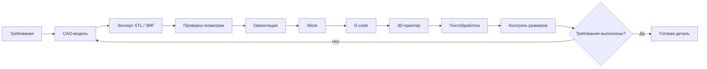
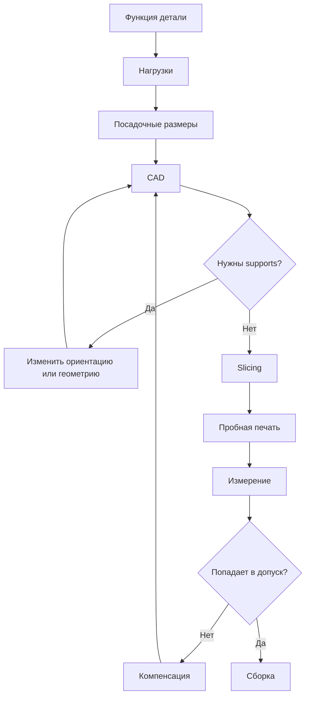
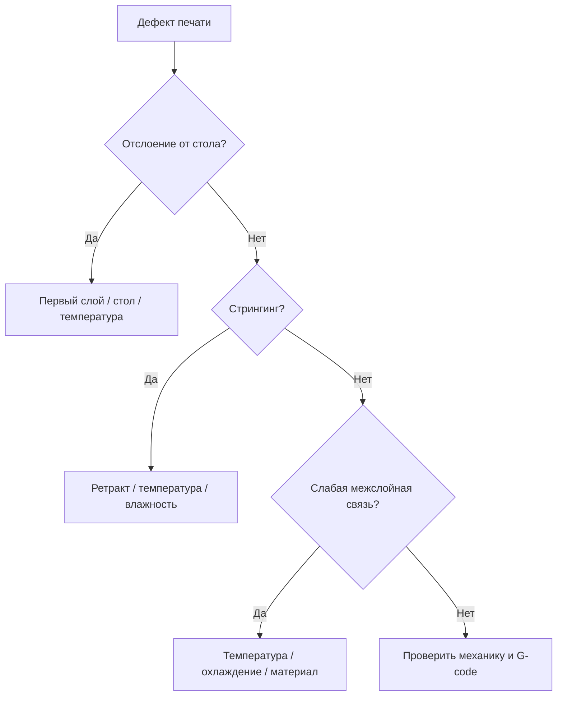

# Дисциплина: Современные цифровые технологии

## Лекция: Раздел 3. Цифровая печать

> **Дисциплина:** «Современные цифровые технологии»  
> **Направление:** 44.03.05 «Педагогическое образование (с двумя профилями подготовки)»  
> **Профиль:** «Информатика и дополнительное образование (робототехника)»  
> **Образовательная организация:** ГАОУ ВО МГПУ  
> **Формат:** GitHub Flavored Markdown  
> **Актуализация:** август 2026 г.


### 1. Аннотация темы и формируемые компетенции (ОПК-2, ОПК-9, УК-1, УК-6)

Раздел рассматривает цифровую печать прежде всего как **аддитивное цифровое производство**, связывающее CAD-модель, подготовку геометрии, slicing, управляющую программу и физическое изготовление детали. Такой подход особенно важен для профиля «Информатика и дополнительное образование (робототехника)»: студент должен уметь не только печатать готовый STL, но и проектировать деталь как элемент робототехнической системы.

Основные отечественные решения:

- **КОМПАС-3D** (АСКОН);
- **T-FLEX CAD**;
- 3D-принтеры **PICASO 3D**;
- актуальная линейка **IMPRINTA Hercules G Series**;
- ПО **Diaprint** для подготовки и управления печатью.

После изучения темы студент должен:

- объяснять отличие аддитивного и субтрактивного производства;
- различать FDM/FFF и фотополимерные технологии;
- понимать цепочку CAD → mesh → slicing → G-code → изделие;
- проектировать деталь с учетом ориентации, допусков и поддержек;
- оценивать время, расход материала и производительность экструзии;
- анализировать типовые дефекты;
- интегрировать 3D-печать в проектную робототехнику;
- соблюдать правила безопасной организации учебной мастерской.

Формируемые компетенции:

- **ОПК-2** — проектирование учебной инженерной деятельности с использованием аддитивных технологий;
- **ОПК-9** — применение CAD, slicer и цифрового производственного оборудования;
- **УК-1** — анализ требований, геометрии, технологических ограничений и дефектов;
- **УК-6** — организация итеративного проектирования и документирование инженерного результата.

### 2. Фундаментальный и прикладной инженерный базис

#### 2.1. Аддитивный принцип

ГОСТ Р 57558-2025 определяет аддитивное производство как процесс создания физического объекта по электронной геометрической модели путем добавления материала, как правило, слой за слоем.

| Подход | Механизм |
|---|---|
| Аддитивный | материал добавляется |
| Субтрактивный | материал удаляется |
| Формообразующий | материал формуется или льется |

#### 2.2. Цифровой технологический маршрут

```text
Требования
→ CAD
→ экспорт геометрии
→ проверка сетки
→ ориентация
→ supports
→ slicing
→ G-code
→ печать
→ постобработка
→ контроль размеров
```

Ошибка на раннем этапе переносится на последующие. Например, неверный диаметр посадочного отверстия нельзя надежно исправить настройками слайсера без изменения геометрии или обоснованной компенсации.

#### 2.3. CAD-модель и mesh

CAD-система описывает геометрию параметрически или граничным представлением. При экспорте в STL поверхность аппроксимируется треугольниками.

Чем меньше допуск аппроксимации, тем больше треугольников и размер файла. STL не хранит полноценную параметрическую историю модели, поэтому исходный CAD-файл следует хранить вместе с экспортированной моделью.

#### 2.4. КОМПАС-3D

Для образовательных целей АСКОН предоставляет учебные решения КОМПАС-3D. Важно различать личную бесплатную учебную лицензию и лицензирование компьютерного класса: программное обеспечение следует устанавливать в соответствии с условиями конкретной образовательной лицензии. Для части учебных задач доступен КОМПАС-3D LT.

#### 2.5. T-FLEX CAD

T-FLEX CAD — российская система параметрического 3D-моделирования и 2D-черчения, поддерживающая подготовку моделей для 3D-печати. На 2026 г. актуальна ветка **T-FLEX CAD 18**, доступна бесплатная учебная версия для некоммерческого использования.

#### 2.6. FDM/FFF

В FDM/FFF термопластичная нить:

1. подается экструдером;
2. нагревается;
3. выдавливается через сопло;
4. формирует дорожки;
5. слой связывается с предыдущим.

Приближенная площадь сечения нити диаметра $d$:

$$
A_f = \frac{\pi d^2}{4}.
$$

Объемный поток пластика:

$$
Q = A_f \cdot v_f,
$$

где $v_f$ — скорость подачи филамента.

Практическая производительность ограничивается не только механической подачей, но и возможностями hotend расплавлять материал с требуемой скоростью.

#### 2.7. Высота слоя

Число слоев:

$$
N \approx \frac{H}{h},
$$

где $H$ — высота модели, а $h$ — высота слоя.

Уменьшение $h$ обычно повышает детализацию по вертикали, но увеличивает число слоев и время печати.

#### 2.8. Заполнение

**Infill** определяет внутреннюю структуру детали.

Высокий процент заполнения не означает автоматически максимальную прочность. На свойства влияют:

- ориентация;
- число периметров;
- материал;
- температура;
- межслойная адгезия;
- геометрия нагрузки.

Для кронштейна робота ориентация слоев относительно нагрузки часто важнее простого перехода с 40% на 100% заполнения.

#### 2.9. Анизотропия

FDM-деталь имеет направленные механические свойства. Межслойная прочность по оси $Z$ может быть ниже прочности в плоскости слоя.

Следовательно, ориентация при печати является частью **конструирования**, а не только настройкой производства.

#### 2.10. Допуски и посадки

Если вал номинально имеет диаметр $D$, а печатное отверстие — тот же номинал, реальная сборка может не сойтись из-за:

- усадки;
- калибровки;
- ширины экструзии;
- аппроксимации;
- «слоновьей ноги»;
- погрешности механики.

В учебном проекте полезно печатать **калибровочную гребенку отверстий** и определять эмпирическую компенсацию для конкретного принтера и материала.

#### 2.11. Supports

Поддержки:

- обеспечивают печать нависающих элементов;
- увеличивают время;
- расходуют материал;
- ухудшают поверхность в месте контакта;
- требуют постобработки.

Инженерный навык — не «включить supports везде», а изменить ориентацию или конструкцию так, чтобы минимизировать их.

#### 2.12. Фотополимерная печать

SLA/DLP/MSLA формирует слои из фотополимерной смолы.

Преимущества:

- высокая детализация;
- гладкая поверхность;
- тонкие элементы.

Ограничения:

- работа с химическими материалами;
- промывка;
- дополнительная засветка;
- требования к СИЗ и вентиляции.

Для школьной мастерской FDM обычно проще с точки зрения организации базового безопасного процесса.

#### 2.13. G-code

Упрощенный пример:

```gcode
G28
G1 Z0.2 F1200
G1 X20 Y20 F3000
G1 X80 Y20 E5.2 F1200
G1 X80 Y80 E10.4
G1 X20 Y80 E15.6
G1 X20 Y20 E20.8
```

G-code — управляющее представление движения и технологических команд. Учащемуся полезно увидеть, как цифровая геометрия превращается в траекторию.

#### 2.14. Отечественные 3D-принтеры

**PICASO 3D** развивает профессиональную линейку Designer для FDM/FFF-печати.

**IMPRINTA** развивает актуальную линейку Hercules G Series, включая модели G3, G4/G4 Duo и G6/G6 Duo. Старый **Hercules Original** снят с производства, поэтому для нового курса корректнее ориентироваться на G-серию.

Для экосистемы Hercules используется ПО **Diaprint** для подготовки заданий и управления печатью.

### 3. Архитектурные диаграммы и алгоритмы (Mermaid.js)

#### 3.1. Полный цифровой производственный контур



#### 3.2. Алгоритм проектирования детали робота



#### 3.3. Контроль дефектов



#### 3.4. Инженерная итерация


### 4. Дидактический блок: методика интеграции темы в школьный курс информатики и кружки робототехники

#### 4.1. Правильный объект учебной деятельности

Слабый вариант:

> Скачать готовую модель и нажать Print.

Сильный вариант:

> Спроектировать кронштейн датчика для конкретного робота, определить размеры, напечатать, измерить, исправить и обосновать изменение.

Так возникает инженерный цикл.

#### 4.2. Проект «Кронштейн датчика расстояния»

Этапы:

1. измерить датчик и шасси;
2. задать требования;
3. создать параметрическую CAD-модель;
4. экспортировать;
5. выбрать ориентацию;
6. напечатать;
7. измерить;
8. установить на робот;
9. оценить вибрации и жесткость;
10. создать версию 2.

#### 4.3. Связь со школьной информатикой

3D-печать позволяет конкретизировать:

- координатные системы;
- геометрические преобразования;
- файловые форматы;
- алгоритмы;
- дискретизацию;
- оптимизацию;
- управление устройством;
- контроль версий инженерной модели.

#### 4.4. Исследовательская лабораторная

Учащиеся печатают три одинаковые балки с разной ориентацией, затем выполняют упрощенный нагрузочный тест.

Цель — экспериментально увидеть анизотропию, а не запомнить определение.

#### 4.5. Безопасность

В кружке должны быть:

- регламент доступа к нагретым элементам;
- вентиляция;
- контроль исправности проводки;
- правила хранения пластика;
- запрет самостоятельного обслуживания нагретого принтера младшими учащимися;
- отдельный порядок работы с фотополимерами.

### 5. Контрольные вопросы и педагогические кейс-ситуации (5 вопросов)

1. Почему STL нельзя считать полноценной заменой исходной параметрической CAD-модели?
2. Деталь высотой 48 мм печатается слоем 0,2 мм. Оцените число слоев. Что произойдет при переходе на 0,1 мм?
3. Кронштейн ломается вдоль слоев при нагрузке. Какие изменения ориентации и конструкции следует рассмотреть до простого увеличения infill?
4. Ученик напечатал отверстие 5,0 мм под вал 5,0 мм, но сборка не выполняется. Как построить корректный эксперимент по компенсации?
5. Как организовать проект по 3D-печати в кружке робототехники так, чтобы оценивался инженерный цикл, а не качество найденной в интернете готовой модели?

### 6. Список рекомендуемой отечественной литературы (до 10 источников по ГОСТ)

1. Тарасова, Т. В. **Аддитивное производство** : учебное пособие / Т. В. Тарасова. — Москва : ИНФРА-М, 2026. — 196 с. — ISBN 978-5-16-014676-8.
2. Галиновский, А. Л. **Аддитивные технологии в производстве изделий аэрокосмической техники** : учебник для вузов / А. Л. Галиновский, Е. С. Голубев, Н. В. Коберник, А. С. Филимонов ; под общ. ред. А. Л. Галиновского. — 2-е изд., перераб. и доп. — Москва : Юрайт, 2026. — 145 с. — ISBN 978-5-534-16005-5.
3. Григорьянц, А. Г. **Аддитивные технологии** : монография / А. Г. Григорьянц, И. Н. Шиганов, А. И. Мисюров. — Москва : Издательство МГТУ им. Н. Э. Баумана, 2025. — 340 с. — ISBN 978-5-7038-6452-4.
4. Беляев, Л. В. **Введение в аддитивные технологии** : учебное пособие / Л. В. Беляев, А. В. Аборкин. — Владимир : Издательство Владимирского государственного университета, 2023. — ISBN 978-5-9984-1796-2.
5. Ляпков, А. А. **Полимерные аддитивные технологии** : учебное пособие для вузов / А. А. Ляпков, А. А. Троян. — 2-е изд., стер. — Санкт-Петербург : Лань, 2024. — 120 с. — ISBN 978-5-507-47656-5.
6. Исмаилов, В. Р. Опыт изготовления и сборки робота-манипулятора с применением технологии 3D-печати / В. Р. Исмаилов, М. В. Тарачков, Л. А. Попова, М. Н. Протасевич // **Международный научно-исследовательский журнал**. — 2024. — № 8 (146). — DOI 10.60797/IRJ.2024.146.143.
7. ГОСТ Р 57558-2025 (ИСО/АСТМ 52900:2021). **Аддитивные технологии. Базовые принципы. Термины и определения**. — Москва : Российский институт стандартизации, 2025. — Введ. 2025-03-31.
8. ГОСТ Р 57589-2017. **Аддитивные технологические процессы. Базовые принципы. Часть 2. Материалы для аддитивных технологических процессов. Общие требования**. — Москва : Стандартинформ, 2017. — Введ. 2017-12-01.
