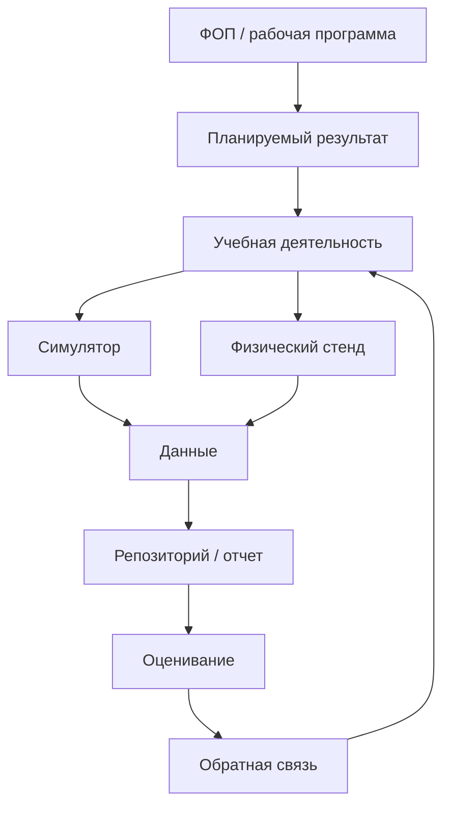
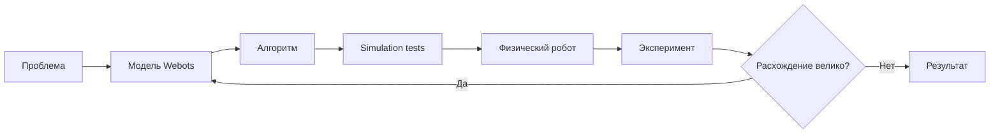
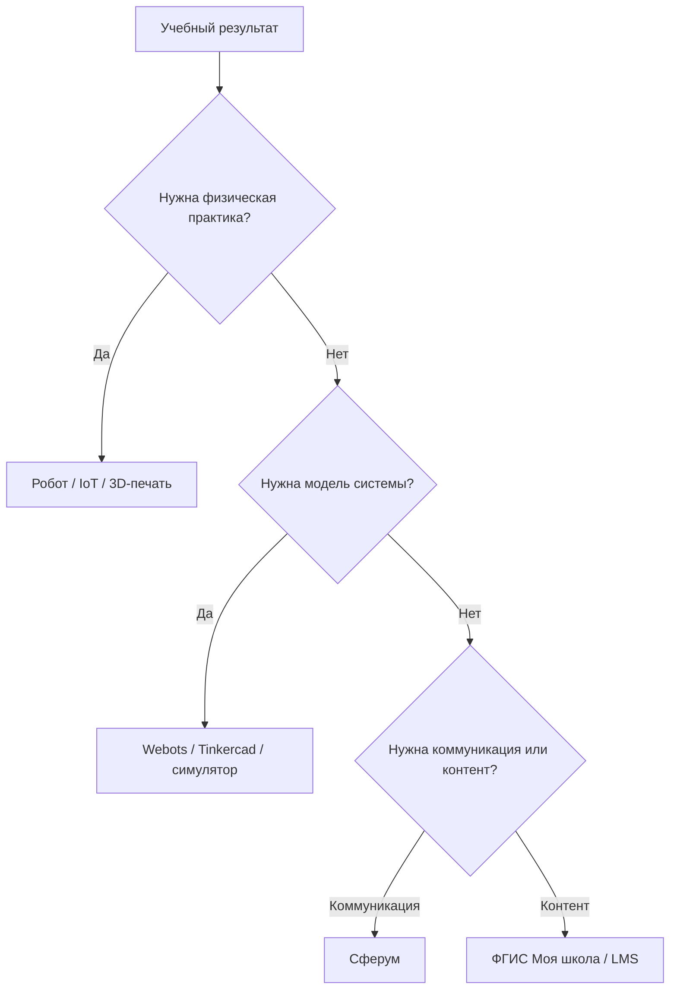
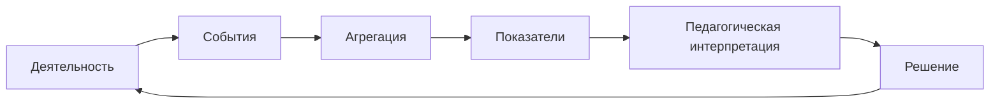

# Дисциплина: Современные цифровые технологии

## Лекция: Раздел 4. Цифровые технологии в образовании

> **Дисциплина:** «Современные цифровые технологии»  
> **Направление:** 44.03.05 «Педагогическое образование (с двумя профилями подготовки)»  
> **Профиль:** «Информатика и дополнительное образование (робототехника)»  
> **Образовательная организация:** ГАОУ ВО МГПУ  
> **Формат:** GitHub Flavored Markdown  
> **Актуализация:** август 2026 г.


### 1. Аннотация темы и формируемые компетенции (ОПК-2, ОПК-9, УК-1, УК-6)

Раздел связывает инженерные технологии предыдущих тем с цифровой дидактикой. Будущий учитель информатики и педагог дополнительного образования должен уметь не только пользоваться цифровыми платформами, но и **проектировать образовательный процесс**, где цифровая среда поддерживает постановку задачи, моделирование, физический эксперимент, обратную связь и рефлексию.

Рассматриваются:

- Федеральные образовательные программы ООО и СОО;
- федеральные рабочие программы по информатике;
- ФГИС «Моя школа»;
- «Сферум» как образовательное пространство в MAX;
- отечественные ОС;
- цифровые симуляторы Webots и Tinkercad;
- учебные CAD/IoT/робототехнические среды;
- проектное обучение;
- цифровой след, образовательная аналитика и этика.

После изучения темы студент должен:

- проектировать цифровой учебный сценарий, а не набор несвязанных сервисов;
- соотносить технологию с планируемым образовательным результатом;
- сочетать симуляцию и физический эксперимент;
- организовывать проектную деятельность по робототехнике;
- учитывать безопасность и персональные данные;
- выбирать отечественное ПО там, где это требуется инфраструктурой;
- оценивать цифровой продукт ученика по прозрачным критериям.

Формируемые компетенции:

- **ОПК-2** — проектирование образовательных программ и занятий с использованием современных цифровых средств;
- **ОПК-9** — применение ИКТ для организации деятельности, коммуникации, моделирования и оценивания;
- **УК-1** — критическая оценка цифрового инструмента, данных и педагогического эффекта;
- **УК-6** — организация собственной и групповой проектной работы, ведение цифрового портфолио.

### 2. Фундаментальный и прикладной инженерный базис

#### 2.1. Цифровая технология не равна цифровой дидактике

Факт использования компьютера не делает урок цифрово трансформированным.

| Уровень | Пример |
|---|---|
| Замещение | PDF вместо бумажного листа |
| Автоматизация | автопроверка теста |
| Изменение процесса | симуляция + физический эксперимент + лог данных |
| Новая учебная деятельность | распределенный IoT-проект с цифровым двойником |

Главный вопрос:

> Какое действие ученика стало возможным или качественно иным благодаря технологии?

#### 2.2. Нормативный контекст

ФОП ООО утверждена приказом Минпросвещения России от 18.05.2023 № 370; к августу 2026 г. действует редакция с последующими изменениями.

ФОП СОО утверждена приказом от 18.05.2023 № 371 и также действует с последующими изменениями.

Федеральные рабочие программы по информатике для основной школы доступны в реестре Единого содержания общего образования.

Следовательно, проектирование цифрового модуля начинается не с выбора сервиса, а с последовательности:

1. планируемый результат;
2. содержание;
3. учебная деятельность;
4. критерий оценивания;
5. цифровая технология.

#### 2.3. Цифровая образовательная среда

Упрощенная модель:

```text
идентификация
+ контент
+ коммуникация
+ деятельность
+ оценивание
+ данные
+ инфраструктура
```

Слабая цифровая среда — набор ссылок.

Сильная — согласованная система, где обучающийся понимает:

- что делать;
- с какими ресурсами;
- как сдавать результат;
- как он оценивается;
- где получить обратную связь.

#### 2.4. ФГИС «Моя школа»

ФГИС «Моя школа» создана как государственная информационная система для поддержки образовательного процесса. В системе предусмотрены роли педагогов, обучающихся, законных представителей и администраторов; развивается база знаний и каталог образовательного контента.

В курсе ее следует рассматривать не как «еще один сайт», а как элемент государственной цифровой образовательной инфраструктуры.

#### 2.5. Сферум

В 2026 г. «Сферум» развивается как образовательное пространство в мессенджере MAX. В учебном сценарии коммуникационный сервис целесообразно использовать для:

- организационных сообщений;
- групповой коммуникации;
- обсуждения проектов;
- оперативного обмена материалами.

При этом он не должен подменять собой репозиторий проекта, LMS или систему хранения исходного кода.

#### 2.6. Репозиторий как образовательный инструмент

Для робототехники Git-репозиторий может содержать:

```text
robot-project/
├── README.md
├── docs/
│   ├── architecture.md
│   └── experiment.md
├── firmware/
├── simulation/
├── cad/
├── data/
└── media/
```

Это формирует:

- версионирование;
- инженерную документацию;
- воспроизводимость;
- культуру совместной разработки.

#### 2.7. Симулятор как модель

Симуляция — не «виртуальная замена настоящего робота», а модель.

Преимущества:

- быстрый повтор;
- отсутствие риска поломки;
- одинаковые стартовые условия;
- измеряемость;
- автоматическое тестирование.

Ограничение:

> результат в симуляторе требует проверки переноса в физическую среду.

Это проблема **sim-to-real gap**.

#### 2.8. Webots

Webots — open-source среда моделирования роботов, поддерживающая физические модели и программирование контроллеров. В 2026 г. развивается Webots Academy как браузерный образовательный слой.

Для вуза и кружка полезна возможность:

- моделировать мобильную платформу;
- проверять регуляторы;
- тестировать объезд препятствий;
- повторять эксперимент;
- переносить алгоритм на реальный робот.

#### 2.9. Tinkercad

Tinkercad — бесплатный браузерный сервис Autodesk для 3D Design, Circuits и Codeblocks.

Tinkercad Circuits позволяет до физического монтажа моделировать:

- Arduino;
- breadboard;
- LED;
- резисторы;
- датчики;
- простые программы.

Поскольку это внешний облачный сервис, для обязательной части курса желательно иметь резервный локальный сценарий.

#### 2.10. Отечественная образовательная робототехника

**РОББО** — российская образовательная экосистема робототехники и программирования с опорой на открытые технологии.

**MGBot** — российское оборудование и методические решения по Интернету вещей и робототехнике.

**Альт Образование** — ОС для образовательных организаций, включающая инструменты для программирования, инженерной графики и робототехники.

**Astra Linux** — отечественная ОС, для которой развиваются образовательные программы для школ, СПО и вузов.

#### 2.11. Проектное обучение

Инженерный проект школьника:

$$
\text{Problem}
\rightarrow
\text{Requirements}
\rightarrow
\text{Model}
\rightarrow
\text{Prototype}
\rightarrow
\text{Experiment}
\rightarrow
\text{Evidence}
\rightarrow
\text{Revision}.
$$

Главный продукт — не только робот, но и **обоснованное инженерное решение**.

#### 2.12. Формирующее оценивание

Оценивать следует не только итоговый объект:

| Объект оценивания | Пример |
|---|---|
| Постановка задачи | требования измеримы |
| Архитектура | компоненты обоснованы |
| Код | работает и документирован |
| Эксперимент | есть методика проверки |
| Данные | результаты сохранены |
| Рефлексия | объяснены ошибки и изменения |

#### 2.13. Цифровой след

Событие в цифровой среде можно представить как:

$$
e_i = (user,\ action,\ resource,\ timestamp,\ context).
$$

Из событий можно строить образовательную аналитику, но необходимо соблюдать принцип минимизации данных.

В педагогике цифровой след — **не самоцель** и не автоматический показатель компетентности. Большое количество кликов не равно качеству обучения.

#### 2.14. Персональные данные и безопасность

При работе со школьниками необходимо разделять:

- учебные данные;
- персональные данные;
- публичные результаты проекта;
- внутренние результаты оценивания.

Не следует публиковать в открытом Git-репозитории:

- ФИО и оценки;
- телефоны;
- токены API;
- данные учетных записей;
- фотографии несовершеннолетних без правового основания;
- приватные ссылки.

### 3. Архитектурные диаграммы и алгоритмы (Mermaid.js)

#### 3.1. Архитектура цифрового учебного модуля



#### 3.2. Симуляция → реальный робот



#### 3.3. Выбор цифрового инструмента



#### 3.4. Data-informed teaching



### 4. Дидактический блок: методика интеграции темы в школьный курс информатики и кружки робототехники

#### 4.1. Модель занятия «Simulation → Hardware → Evidence»

**Этап 1.** Постановка инженерной задачи.

**Этап 2.** Разработка в симуляторе.

**Этап 3.** Проверка базовых требований.

**Этап 4.** Запуск на реальном роботе.

**Этап 5.** Сбор телеметрии.

**Этап 6.** Анализ расхождения.

**Этап 7.** Новая версия.

Такой урок связывает программирование, моделирование и эксперимент.

#### 4.2. Пример «Робот должен остановиться в 20 см»

В Webots учащийся реализует регулятор.

На физическом роботе возникает ошибка из-за:

- шума датчика;
- инерции;
- задержки цикла;
- сцепления колес.

Методический эффект: ученик видит, что программа — модель, взаимодействующая с физическим миром.

#### 4.3. Цифровой портфолио-проект

Итог кружка:

```text
README
видео
CAD
код
схема
данные эксперимента
графики
выводы
версия 1 / версия 2
```

Такой формат позволяет оценивать не только демонстрацию робота, но и весь процесс.

#### 4.4. Роль образовательных платформ и инженерных сред

| Инструмент | Роль |
|---|---|
| ФГИС «Моя школа» / LMS | контент, задания, образовательный маршрут |
| Сферум | оперативная коммуникация |
| Git | инженерные артефакты и версии |
| Webots / Tinkercad | моделирование |
| Физический стенд | эксперимент |
| CAD | проектирование конструкции |

#### 4.5. Методика оценки группового проекта

Не следует ставить всем участникам одинаковую оценку только за работающего робота.

Компоненты:

- общий результат;
- индивидуальный вклад;
- история Git;
- защита архитектуры;
- ответы на вопросы;
- качество эксперимента.

### 5. Контрольные вопросы и педагогические кейс-ситуации (5 вопросов)

1. Почему наличие ФГИС, мессенджера и LMS еще не гарантирует существование целостной цифровой образовательной среды?
2. Как соотнести учебный проект по робототехнике с ФОП и федеральной рабочей программой, чтобы технология не становилась самоцелью?
3. Ученик успешно прошел Webots-сценарий, но реальный робот сталкивается с препятствием. Какие причины sim-to-real gap следует исследовать?
4. Как распределить функции между «Моей школой», Сферумом, Git-репозиторием и физической лабораторией в одном учебном проекте?
5. Какие данные цифрового следа действительно могут помочь преподавателю, а какие создают риск ложных педагогических выводов?

### 6. Список рекомендуемой отечественной литературы (до 10 источников по ГОСТ)

1. Сафонов, А. А. **Цифровая трансформация образования** : учебник и практикум для вузов / А. А. Сафонов, М. А. Сафонова. — Москва : Юрайт, 2025. — 100 с. — (Высшее образование). — ISBN 978-5-534-21363-8.
2. Соловова, Н. В. **Цифровая дидактика: технологии и сервисы** : учебное пособие / Н. В. Соловова, Д. О. Ежков, А. Н. Рылов, Н. В. Суханкина. — Самара : Издательство Самарского университета, 2025. — 82 с. — ISBN 978-5-7883-2194-3.
3. Пустыльник, П. Н. **Педагогика. Образовательная робототехника** : учебное пособие для вузов / П. Н. Пустыльник. — Санкт-Петербург : Лань, 2026. — 88 с. — ISBN 978-5-507-53906-2.
4. Чупин, Д. Ю. **Образовательная робототехника** : учебное пособие для студентов педагогических вузов / Д. Ю. Чупин, А. А. Ступин, Е. Е. Ступина, А. Б. Классов. — Новосибирск : Сибпринт, 2019. — 114 с. — ISBN 978-5-94301-771-1.
5. Корытова, Г. С. Цифровая образовательная среда как фактор трансформации личности обучающегося / Г. С. Корытова // **Education & Pedagogy Journal**. — 2024. — № 1. — С. 23–35. — DOI 10.23951/2782-2575-2024-1-23-35.
6. Левушкина, А. С. Развитие основ инженерного мышления школьников с помощью среды TRIK Studio и/или на базе платформы Arduino / А. С. Левушкина // **Информатика в школе**. — 2024. — Т. 23, № 6. — С. 43–63. — DOI 10.32517/2221-1993-2024-23-6-43-63.
7. Российская Федерация. Министерство просвещения. **Об утверждении федеральной образовательной программы основного общего образования** : приказ от 18.05.2023 № 370 : с изм. и доп. — Зарегистрирован в Минюсте России 12.07.2023 № 74223.
8. Российская Федерация. Министерство просвещения. **Об утверждении федеральной образовательной программы среднего общего образования** : приказ от 18.05.2023 № 371 : с изм. и доп. — Зарегистрирован в Минюсте России 12.07.2023 № 74228.
9. Российская Федерация. Правительство. **О федеральной государственной информационной системе «Моя школа»** : постановление Правительства Российской Федерации от 13.07.2022 № 1241.
