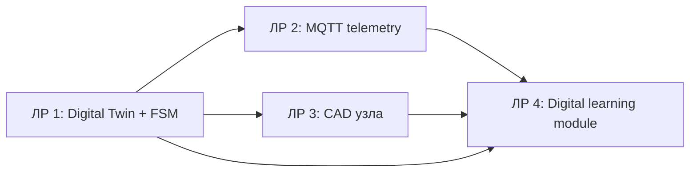

# Лабораторный практикум по дисциплине «Современные цифровые технологии»

**Направление:** 44.03.05 «Педагогическое образование (с двумя профилями подготовки)»  
**Профиль:** «Информатика и дополнительное образование (робототехника)»

Практикум реализует единый сквозной кейс: **проектирование роботизированного образовательного комплекса**.

## Лабораторные работы

1. [ЛР № 1. Цифровой двойник и FSM управляющего узла](lab_01.md)
2. [ЛР № 2. IoT-телеметрия ESP32 / Pico W и MQTT](lab_02.md)
3. [ЛР № 3. КОМПАС-3D и подготовка к 3D-печати](lab_03.md)
4. [ЛР № 4. Интерактивный цифровой обучающий модуль](lab_04.md)

## Сквозная логика



## Оценивание

Каждая работа — **20 баллов**:

| Компонент | Баллы |
|---|---:|
| Работоспособность и корректность решения | 6 |
| Точность индивидуального варианта | 5 |
| Инженерно-методическая оптимизация и анализ | 5 |
| Репозиторий, воспроизводимость и защита | 4 |
| **Итого за ЛР** | **20** |

**Итого за практикум: 80 баллов.**

Каждая лабораторная содержит **ровно 25 уникальных индивидуальных вариантов**.

## Рекомендуемая структура репозитория студента

```text
robot-education-complex/
├── README.md
├── lab01/
├── lab02/
├── lab03/
└── lab04/
```

Рекомендуется сохранять один номер варианта на весь сквозной проект, если преподаватель не назначил иное.
