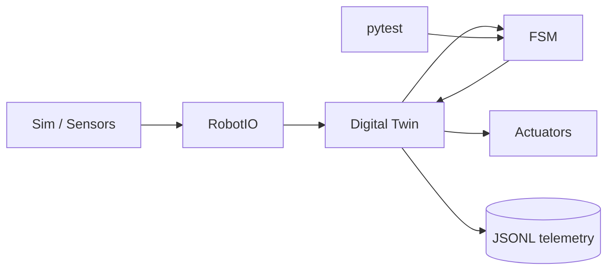

# Лабораторная работа № 1. Разработка цифрового двойника и программной логики управляющего узла робота в среде отечественной ОС (Astra Linux/ALT Linux) на Python

## 1. Цели, задачи и индикаторы компетенций

**Раздел дисциплины:** «Цифровые технологии».  
**Максимальная оценка:** **20 баллов**.

### Цель

Разработать программный прототип управляющего узла роботизированного образовательного комплекса и его цифровой двойник, реализовав модель состояния, обработку сенсорных данных и алгоритм управления на основе конечного автомата (FSM) в Python 3.10+ под Astra Linux либо ОС семейства «Альт».

### Задачи

1. Формализовать физический объект как набор состояний, входов, выходов и ограничений.
2. Разработать структуру цифрового двойника.
3. Реализовать FSM и отделить его от драйверов оборудования.
4. Обеспечить режим симуляции без физического стенда.
5. Организовать журналирование телеметрии в JSONL/CSV.
6. Проверить аварийные и граничные переходы.
7. Оформить воспроизводимый Git-репозиторий.

### Индикаторы компетенций

- **ОПК-2:** проектирует учебно-инженерную деятельность с применением цифровых технологий.
- **ОПК-9:** применяет программные средства и ИКТ для моделирования и управления техническим объектом.
- **УК-1:** формализует требования, анализирует состояния, события, ограничения и риски.
- **УК-6:** организует разработку, тестирование и документирование цифрового проекта.

## 2. Аппаратно-программное обеспечение рабочего места

### Минимально

- ПК x86-64, 8 ГБ ОЗУ;
- Astra Linux либо **Альт Образование 11.2 / Альт Рабочая станция 11.x**;
- Python 3.10+;
- Git;
- VS Code/VSCodium, PyCharm Community либо иной редактор;
- `venv`;
- библиотека `pytest`.

### Рекомендуемо

- 16 ГБ ОЗУ;
- USB-UART адаптер;
- учебный контроллер/стенд по варианту;
- осциллограф или логический анализатор — при наличии;
- доступ к Git-серверу кафедры/GitFlic/GitHub.

> На актуальной странице BaseALT доступна «Альт Образование 11.2» для x86-64 и aarch64. Для Astra Linux предусмотрены образовательные программы для вузов, СПО и школ. В лабораторной допустима любая из этих ОС при условии воспроизводимого Python-окружения.

### Создание окружения

```bash
python3 -m venv .venv
source .venv/bin/activate
python -m pip install --upgrade pip
pip install pytest pydantic
```

Структура проекта:

```text
lab01-digital-twin/
├── README.md
├── requirements.txt
├── src/
│   ├── model.py
│   ├── fsm.py
│   ├── io_sim.py
│   └── main.py
├── tests/
│   └── test_fsm.py
├── data/
│   └── telemetry.jsonl
└── docs/
    ├── architecture.md
    └── fsm.md
```

## 3. Теоретический базис и пошаговый алгоритм выполнения (с листингами кода и настройками ПО)

### 3.1. Модель цифрового двойника

Цифровой двойник в рамках работы — программная модель текущего состояния физического узла:

$$
Twin_t = (State_t, Sensors_t, Actuators_t, Setpoints_t, Errors_t, Time_t).
$$

Его задача — обеспечить одинаковый интерфейс для симуляции и реального устройства.

```python
from dataclasses import dataclass, field
from enum import Enum, auto
from time import time

class State(Enum):
    IDLE = auto()
    RUN = auto()
    AVOID = auto()
    FAULT = auto()

@dataclass
class SensorFrame:
    distance_cm: list[float] = field(default_factory=list)
    current_a: float = 0.0

@dataclass
class ActuatorFrame:
    left_motor: float = 0.0
    right_motor: float = 0.0

@dataclass
class RobotTwin:
    state: State = State.IDLE
    sensors: SensorFrame = field(default_factory=SensorFrame)
    actuators: ActuatorFrame = field(default_factory=ActuatorFrame)
    error: str | None = None
    timestamp: float = field(default_factory=time)
```

### 3.2. FSM

Конечный автомат:

$$
s_{t+1} = \delta(s_t, x_t),
$$

где $s_t$ — состояние, $x_t$ — входные события/измерения, $\delta$ — функция перехода.

Пример:

```python
def update_fsm(twin: RobotTwin) -> None:
    d = min(twin.sensors.distance_cm or [999.0])

    if twin.sensors.current_a > 2.0:
        twin.state = State.FAULT
        twin.error = "overcurrent"
        twin.actuators = ActuatorFrame()
        return

    match twin.state:
        case State.IDLE:
            twin.state = State.RUN

        case State.RUN:
            if d < 25:
                twin.state = State.AVOID
            else:
                twin.actuators.left_motor = 0.45
                twin.actuators.right_motor = 0.45

        case State.AVOID:
            twin.actuators.left_motor = -0.25
            twin.actuators.right_motor = 0.25
            if d >= 35:
                twin.state = State.RUN

        case State.FAULT:
            twin.actuators = ActuatorFrame()
```

### 3.3. Отделение аппаратного ввода-вывода

Запрещается смешивать логику FSM с чтением GPIO/Serial. Создайте интерфейс:

```python
from typing import Protocol

class RobotIO(Protocol):
    def read_sensors(self) -> SensorFrame: ...
    def apply_actuators(self, frame: ActuatorFrame) -> None: ...
```

Симулятор:

```python
class SimIO:
    def __init__(self):
        self.step = 0

    def read_sensors(self) -> SensorFrame:
        self.step += 1
        distance = 20.0 if 8 <= self.step <= 12 else 80.0
        return SensorFrame(
            distance_cm=[distance],
            current_a=0.6
        )

    def apply_actuators(self, frame: ActuatorFrame) -> None:
        print("ACT:", frame)
```

### 3.4. Главный цикл

```python
import json
from dataclasses import asdict
from time import sleep, time

def run(io: RobotIO, steps: int = 30) -> None:
    twin = RobotTwin()

    with open("data/telemetry.jsonl", "w", encoding="utf-8") as log:
        for _ in range(steps):
            twin.sensors = io.read_sensors()
            twin.timestamp = time()

            update_fsm(twin)
            io.apply_actuators(twin.actuators)

            row = asdict(twin)
            row["state"] = twin.state.name
            log.write(json.dumps(row, ensure_ascii=False) + "\n")

            sleep(0.05)
```

### 3.5. Инварианты безопасности

Для каждого варианта определите не менее трех инвариантов, например:

```text
FAULT => motor_left = 0 AND motor_right = 0
limit_top = 1 => lift_up = 0
temperature < Tmin => extruder_feed = 0
obstacle = 1 => gate_close = 0
```

### 3.6. Автоматический тест FSM

```python
def test_fault_stops_motors():
    twin = RobotTwin(state=State.RUN)
    twin.sensors = SensorFrame(
        distance_cm=[100],
        current_a=5.0
    )
    twin.actuators = ActuatorFrame(0.8, 0.8)

    update_fsm(twin)

    assert twin.state is State.FAULT
    assert twin.actuators.left_motor == 0
    assert twin.actuators.right_motor == 0
```

Запуск:

```bash
pytest -q
```

### 3.7. Диаграмма архитектуры



### 3.8. Порядок выполнения

1. Получить вариант.
2. Выделить сенсоры, актуаторы, состояния и аварии.
3. Построить Mermaid-диаграмму FSM.
4. Реализовать dataclass цифрового двойника.
5. Реализовать `SimIO`.
6. Реализовать FSM.
7. Добавить не менее 5 тестов переходов.
8. Получить не менее 100 строк телеметрии.
9. Проанализировать минимум один ошибочный/аварийный сценарий.
10. Оформить отчет и README.

## 4. Таблица 25 индивидуальных вариантов

| Вариант | Объект / Кинематический узел | Технические параметры / Датчики | Требования к реализации / Выходной результат |
|:-------:|:----------------------------|:--------------------------------|:---------------------------------------------|
| 1 | Двухколёсная мобильная платформа | 2 DC-мотора; 3 ультразвуковых датчика: левый/центр/правый | FSM: IDLE → FORWARD → AVOID_LEFT/AVOID_RIGHT → STOP; цифровой двойник хранит pose, speed, distance[3] |
| 2 | Мобильный робот с сервоприводным поворотом датчика | 2 DC-мотора; 1 ультразвуковой датчик на сервоприводе; энкодеры | FSM: SCAN → SELECT_DIRECTION → MOVE → RESCAN; оценивать пройденный путь по энкодерам |
| 3 | Робот-линейщик | 2 DC-мотора; матрица 5 ИК-датчиков линии | FSM: SEARCH_LINE → FOLLOW → RECOVER_LEFT/RIGHT → FINISH; в twin хранить бинарный/нормированный вектор сенсоров |
| 4 | Робот-линейщик с перекрёстками | 2 DC-мотора; 8 ИК-датчиков линии; кнопка старта | FSM: WAIT → FOLLOW → INTERSECTION → TURN → FOLLOW; различать T- и X-перекрёстки |
| 5 | Мини-конвейер | DC-мотор ленты; ИК-барьер; концевик; датчик тока | FSM: READY → FEED → DETECT → STOP_POSITION → RELEASE; аварийный переход OVERCURRENT |
| 6 | Сортировочный манипулятор | 2 сервопривода; датчик цвета; концевик нулевой позиции | FSM: HOME → WAIT_OBJECT → CLASSIFY → PICK → PLACE_A/B/C → HOME |
| 7 | Двухпальцевый захват | Сервопривод захвата; датчик силы/FSR; датчик тока | FSM: OPEN → APPROACH → CLOSE → HOLD → RELEASE; ограничить усилие программным порогом |
| 8 | Поворотная платформа | Шаговый двигатель; оптический home-датчик; абсолютный/инкрементальный энкодер | FSM: HOMING → READY → ROTATE → SETTLE → READY; twin хранит target_angle и measured_angle |
| 9 | Двухосевой учебный манипулятор | 2 сервопривода; 2 потенциометра обратной связи; 2 концевика | FSM: HOME → MOVE_J1 → MOVE_J2 → VERIFY → DONE; контролировать допустимые диапазоны суставов |
| 10 | Подъёмник робототехнического стенда | DC-мотор/редуктор; верхний и нижний концевики; датчик тока | FSM: BOTTOM → UP → TOP → DOWN; состояния JAM и EMERGENCY при превышении тока |
| 11 | Панорамный модуль камеры | 2 сервопривода pan/tilt; IMU; кнопка калибровки | FSM: CALIBRATE → TRACK → HOLD → PARK; twin хранит pan, tilt, roll, pitch |
| 12 | Балансирующий стенд | 2 DC-мотора; IMU 6DoF; энкодеры | FSM верхнего уровня: INIT → BALANCE → MOVE → FALLEN → RECOVER; моделировать угол и угловую скорость |
| 13 | Робот для парковки | 2 DC-мотора; 2 ультразвуковых датчика; энкодеры | FSM: SEARCH_SLOT → ALIGN → REVERSE → CENTER → PARKED; вести оценку distance_to_wall |
| 14 | Робот с бамперами | 2 DC-мотора; 4 контактных бампера; 1 ToF-датчик | FSM: CRUISE → BUMPER_EVENT → BACKUP → ROTATE → CRUISE; приоритет контактного события |
| 15 | Лабораторный клапанный модуль | Соленоидный клапан через реле/MOSFET; датчик уровня; датчик протечки | FSM: EMPTY → FILL → FULL → DRAIN; LEAK имеет наивысший приоритет и выключает клапан |
| 16 | Автоматическая кормушка/дозатор | Шаговый двигатель; оптический датчик оборота; датчик массы | FSM: WAIT → DOSE → WEIGH → CORRECT → DONE; дозирование по массе с ограничением числа коррекций |
| 17 | Роботизированный шлагбаум | Сервопривод; 2 ИК-датчика наличия; концевик | FSM: CLOSED → OPENING → OPEN → CLOSING; запрет закрытия при занятой зоне |
| 18 | Учебная дверь с приводом | DC-мотор; 2 концевика; датчик расстояния; токовый датчик | FSM: CLOSED → OPENING → OPEN → CLOSING; OBSTACLE вызывает немедленное открытие |
| 19 | Поворотный сканер расстояния | Шаговый двигатель; ToF-датчик; home-датчик | FSM: HOME → STEP → MEASURE → STORE → NEXT → COMPLETE; twin содержит массив angle-distance |
| 20 | Роботизированная тележка с грузом | 2 DC-мотора; тензодатчик; IMU; энкодеры | FSM: EMPTY → LOADED → MOVE → ARRIVED → UNLOAD; скорость ограничивается по массе груза |
| 21 | Стабилизируемая платформа | 2 сервопривода; IMU; датчик вибрации | FSM: INIT → LEVEL → STABILIZE → SAFE; фиксировать RMS вибрации и углы |
| 22 | Учебный экструдер/подающий механизм | Шаговый двигатель; термодатчик; энкодер подачи; датчик тока | FSM: COLD → HEATING → READY → FEED → STOP; запрет FEED ниже заданной температуры |
| 23 | Светоследящий робот | 2 DC-мотора; матрица 4 фоторезисторов | FSM: SEARCH → ALIGN → APPROACH → HOLD; twin хранит light[4] и вычисленный градиент |
| 24 | Робот для движения по коридору | 2 DC-мотора; левый и правый ToF; фронтальный ультразвук | FSM: CENTER → CORRECT_LEFT/RIGHT → OBSTACLE → TURN; контролировать симметрию боковых расстояний |
| 25 | Модуль аварийной остановки робота | Реле/контактор; кнопка E-STOP; датчик тока; watchdog-сигнал | FSM: INIT → ARMED → RUN → FAULT → LOCKOUT → RESET; FAULT должен переводить выход в безопасное состояние |

## 5. Требования к составу артефактов в GitHub-репозитории (исходный код, CAD/STL-файлы, G-код, схемы, README.md)

Для ЛР № 1 обязательны:

```text
lab01/
├── README.md
├── requirements.txt
├── src/
│   ├── model.py
│   ├── fsm.py
│   ├── io_sim.py
│   └── main.py
├── tests/
│   └── test_fsm.py
├── data/
│   └── telemetry.jsonl
└── docs/
    ├── architecture.md
    ├── fsm.md
    └── analysis.md
```

`README.md` должен содержать:

- номер варианта;
- ОС и версию Python;
- команды создания `venv`;
- команду запуска;
- команду тестирования;
- Mermaid-схему FSM;
- таблицу состояний и переходов;
- три инварианта безопасности;
- краткий анализ результатов.

Если используется физический стенд, дополнительно приложите `wiring.md` и схему подключения.

## 6. Детализированный критериальный рубрикатор (Строго 20 баллов)

| Критерий | Детализация | Баллы |
|---|---|---:|
| **Работоспособность и корректность программно-аппаратного/CAD решения** | Цифровой двойник запускается — 2; FSM корректно реализует переходы — 2; тесты и безопасные состояния работают — 2 | **6** |
| **Точность реализации параметров индивидуального варианта** | Полный набор заданных сенсоров/актуаторов — 2; все обязательные состояния — 2; заданные ограничения/выходной результат — 1 | **5** |
| **Инженерно-методическая оптимизация и анализ результатов** | Отделение I/O от логики — 1; анализ телеметрии — 1; аварийный сценарий — 1; обоснование архитектуры — 1; вывод о применимости в учебном стенде — 1 | **5** |
| **Оформление репозитория, воспроизводимость инструкций, защита отчета** | README и структура — 1; `requirements.txt`/команды — 1; схемы и данные — 1; защита и ответы на вопросы — 1 | **4** |
| **Итого** |  | **20** |
