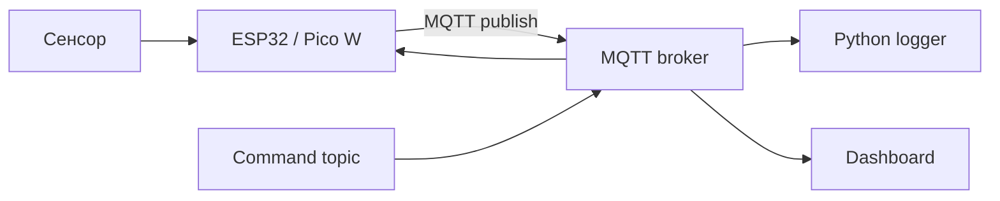

# Лабораторная работа № 2. Построение телеметрического IoT-канала робототехнического стенда на базе ESP32/RP2040 и протокола MQTT с визуализацией в дашборде

## 1. Цели, задачи и индикаторы компетенций

**Раздел дисциплины:** «Интернет вещей».  
**Максимальная оценка:** **20 баллов**.

### Цель

Построить воспроизводимый IoT-канал `sensor → microcontroller → MQTT broker → subscriber/dashboard`, обеспечив телеметрию роботизированного образовательного комплекса, структурированный JSON-формат сообщений и визуальный контроль параметров.

### Задачи

1. Подключить сенсоры индивидуального варианта.
2. Спроектировать иерархию MQTT topics.
3. Задать JSON schema телеметрии.
4. Реализовать публикацию с ESP32 либо Pico W.
5. Развернуть локальный MQTT broker на Astra Linux/ALT Linux.
6. Реализовать subscriber/logger.
7. Создать dashboard.
8. Исследовать потерю связи, частоту публикации и QoS.

### Индикаторы компетенций

- **ОПК-2:** проектирует учебный IoT-сценарий и распределяет действия между устройством, сетью и пользователем.
- **ОПК-9:** применяет MQTT, микроконтроллеры, сетевые сервисы и средства визуализации.
- **УК-1:** анализирует структуру topics, объем телеметрии, надежность и ограничения.
- **УК-6:** обеспечивает воспроизводимую настройку стенда и документирование параметров.

## 2. Аппаратно-программное обеспечение рабочего места

### Аппаратная часть

Один из вариантов:

- **ESP32** с Wi‑Fi;
- **Raspberry Pi Pico W/WH** на RP2040;
- обычная плата на RP2040 допускается только при наличии внешнего Wi‑Fi/Ethernet-модуля.

> Важно: сам микроконтроллер RP2040 и обычный Raspberry Pi Pico не содержат Wi‑Fi. Для прямого MQTT по беспроводной сети используйте **Pico W/WH** либо внешний сетевой интерфейс.

Также:

- breadboard;
- USB-кабель;
- сенсоры индивидуального варианта;
- резисторы/преобразователи уровня при необходимости;
- ПК с Astra Linux или ALT Linux.

### Программная часть

- Mosquitto broker/client;
- Python 3.10+;
- `paho-mqtt`;
- MicroPython/Arduino framework;
- dashboard: Node-RED Dashboard, Grafana либо собственный Python dashboard;
- Git.

Установка брокера в Debian-подобной среде зависит от ОС и настроенных репозиториев. Проверка после установки:

```bash
mosquitto -h
mosquitto_sub -h
mosquitto_pub -h
```

Python:

```bash
python3 -m venv .venv
source .venv/bin/activate
pip install paho-mqtt pandas
```

## 3. Теоретический базис и пошаговый алгоритм выполнения (с листингами кода и настройками ПО)

### 3.1. Архитектура



### 3.2. Topic design

Рекомендуемая схема:

```text
course/<variant>/<device>/<channel>
```

Например:

```text
course/v03/robot01/distance
course/v03/robot01/status
course/v03/robot01/cmd
```

Требования:

- только латиница в технических topics;
- идентификатор варианта;
- идентификатор устройства;
- отдельная ветка для команд;
- wildcard-подписка должна быть осмысленной.

### 3.3. JSON-пакет

Пример:

```json
{
  "device_id": "robot01",
  "seq": 125,
  "ts_ms": 182340,
  "distance_cm": 31.4,
  "battery_v": 7.21,
  "status": "RUN"
}
```

Обязательные поля во всех вариантах:

- `device_id`;
- `seq`;
- локальная отметка времени/uptime;
- минимум два измеряемых/вычисляемых поля, если это предусмотрено вариантом.

### 3.4. Публикация с ESP32: MicroPython

Концептуальный пример:

```python
import network
import time
import json
from umqtt.simple import MQTTClient

SSID = "LAB_WIFI"
PASSWORD = "CHANGE_ME"
BROKER = "192.168.1.10"

wlan = network.WLAN(network.STA_IF)
wlan.active(True)
wlan.connect(SSID, PASSWORD)

while not wlan.isconnected():
    time.sleep_ms(200)

client = MQTTClient(
    client_id=b"robot-v02",
    server=BROKER,
    port=1883
)
client.connect()

seq = 0

while True:
    seq += 1

    payload = {
        "device_id": "robot-v02",
        "seq": seq,
        "ts_ms": time.ticks_ms(),
        "distance_cm": 42.1
    }

    client.publish(
        b"course/v02/robot/distance",
        json.dumps(payload)
    )

    time.sleep(1)
```

Для реального задания замените фиктивное `distance_cm` чтением сенсора.

### 3.5. Pico W

Для Pico W код построения Wi‑Fi/MQTT-канала аналогичен концептуально, но конкретная версия MicroPython и MQTT-библиотеки должна быть зафиксирована в README.

Проверка сети:

```python
import network

wlan = network.WLAN(network.STA_IF)
wlan.active(True)

print(wlan.status())
print(wlan.ifconfig())
```

### 3.6. Python subscriber/logger

```python
import json
import csv
from datetime import datetime, timezone

import paho.mqtt.client as mqtt

BROKER = "127.0.0.1"
TOPIC = "course/+/+/+"

def on_message(client, userdata, msg):
    raw = msg.payload.decode("utf-8")

    try:
        data = json.loads(raw)
    except json.JSONDecodeError:
        print("BAD JSON:", raw)
        return

    row = {
        "server_time": datetime.now(
            timezone.utc
        ).isoformat(),
        "topic": msg.topic,
        **data
    }

    print(row)

client = mqtt.Client(
    mqtt.CallbackAPIVersion.VERSION2
)
client.on_message = on_message

client.connect(BROKER, 1883, 60)
client.subscribe(TOPIC, qos=0)
client.loop_forever()
```

Сохраняйте данные в CSV/JSONL не менее 5 минут либо не менее 200 сообщений.

### 3.7. Частота и объем телеметрии

При частоте $f$ сообщений/с и среднем payload $S$ байт:

$$
V_{day} = S \cdot f \cdot 86400.
$$

Посчитайте полезный объем по своему варианту и сравните минимум для двух частот публикации.

### 3.8. QoS

В работе необходимо сравнить QoS 0 и QoS 1 минимум на одном topic.

Фиксируйте:

- число отправленных сообщений;
- число принятых;
- дубликаты, если возникли;
- задержку в условиях искусственного разрыва связи.

### 3.9. Dashboard

Минимальные требования:

1. не менее 3 визуальных компонентов;
2. временной график хотя бы одного параметра;
3. пороговое состояние/alert;
4. подписи единиц измерения;
5. идентификатор устройства/варианта.

Допускается Node-RED, Grafana или собственный Python-интерфейс.

### 3.10. Безопасность

В учебной работе запрещено:

- использовать публичный broker без согласования;
- хранить Wi‑Fi пароль в публичном Git;
- включать anonymous access в доступной извне сети.

`.env.example`:

```text
MQTT_HOST=192.168.1.10
MQTT_USER=
MQTT_PASSWORD=
```

### 3.11. Эксперимент

Выполните два режима:

- **Normal**: стабильная сеть;
- **Degraded**: отключите Wi‑Fi/broker на 20–30 секунд.

Опишите:

- что происходит с seq;
- восстанавливается ли клиент;
- теряются ли сообщения;
- как это видно на dashboard.

## 4. Таблица 25 индивидуальных вариантов

| Вариант | Объект / Кинематический узел | Технические параметры / Датчики | Требования к реализации / Выходной результат |
|:-------:|:----------------------------|:--------------------------------|:---------------------------------------------|
| 1 | Климатический модуль | ESP32; BME280: температура/влажность/давление | Topics: lab/v1/climate; JSON: ts,t,h,p; dashboard: 3 графика + alert T>28°C |
| 2 | Освещённость рабочего места | ESP32; BH1750 + фоторезистор | Topics: lab/v2/light/raw и /lux; сравнить два сенсора; dashboard: lux и относительный уровень |
| 3 | Парковочный датчик робота | ESP32; HC-SR04/совместимый ультразвуковой датчик | Topic: lab/v3/distance; JSON: distance_cm,status; alert при <20 см |
| 4 | Инерциальный модуль | ESP32; MPU6050/IMU 6DoF | Topics: lab/v4/imu; JSON: ax,ay,az,gx,gy,gz; dashboard: ускорение и модуль вектора |
| 5 | Контроль тока двигателя | ESP32; INA219/INA226 | Topics: lab/v5/power; JSON: voltage_v,current_a,power_w; alert по току |
| 6 | Телеметрия мобильного робота | ESP32; ультразвук + энкодеры | Topics: robot/v6/distance и robot/v6/encoders; JSON раздельный; dashboard: distance, left_ticks, right_ticks |
| 7 | Климат + освещение | ESP32; BME280 + BH1750 | Topic: lab/v7/environment; единый JSON; dashboard: T/H/P/Lux и derived comfort flag |
| 8 | Контроль вибрации | ESP32; IMU + датчик вибрации | Topic: robot/v8/vibration; JSON: rms_accel,peak,event; строить временной ряд и события |
| 9 | Стенд энергопотребления | ESP32; INA219 + датчик температуры | Topic: lab/v9/energy; JSON: V,I,P,T; вычислять Wh интегрированием на стороне dashboard |
| 10 | Датчик присутствия | ESP32; PIR + освещённость | Topics: room/v10/presence и /lux; JSON: occupied,lux; правило: событие при presence=1 и lux<100 |
| 11 | Контроль уровня | ESP32; ультразвук над резервуаром + температура | Topic: lab/v11/tank; JSON: distance_cm,level_pct,temp; dashboard с уровнем в % |
| 12 | Телеметрия захвата | ESP32; FSR/тензодатчик + ток сервопривода | Topic: robot/v12/gripper; JSON: force,current,state; alert force>limit |
| 13 | Ориентация платформы | ESP32; IMU + энкодер поворотной оси | Topic: robot/v13/orientation; JSON: yaw,pitch,roll,encoder_deg; сравнить два угла |
| 14 | RP2040 Pico W: климат | Pico W (RP2040 + Wi‑Fi); BME280 | MicroPython MQTT; topic pico/v14/climate; JSON: t,h,p,rssi; dashboard: климат + RSSI |
| 15 | RP2040 Pico W: расстояние | Pico W; ToF VL53L0X/совместимый | Topic pico/v15/tof; JSON: distance_mm,quality; частота 5 Гц; dashboard + threshold |
| 16 | RP2040 Pico W: освещение | Pico W; BH1750 + кнопка события | Topics pico/v16/lux и /button; JSON с seq; отображать lux и счетчик нажатий |
| 17 | Умный светофор | ESP32; фоторезистор + кнопка/ИК-датчик | Topics city/v17/light и city/v17/pedestrian; dashboard + команда cmd/mode |
| 18 | Роботизированный шлагбаум | ESP32; 2 ИК-датчика + ток привода | Topics gate/v18/in, /out, /current; JSON; dashboard показывает занятость и ток |
| 19 | Метеостанция стенда | ESP32; BME280 + датчик освещённости + дождя/влажности | Topic meteo/v19/all; JSON: t,h,p,lux,rain; dashboard минимум 5 индикаторов |
| 20 | Контроль качества питания | ESP32; INA219 + ADC делитель + датчик температуры | Topic power/v20/status; JSON: bus_v,load_v,current,temp; вычислять alarm_reason |
| 21 | Сенсорная матрица линии | ESP32; 8 ИК-каналов | Topic robot/v21/line; JSON: sensors[8],position; dashboard: 8 индикаторов + вычисленная позиция |
| 22 | Телеметрия двух двигателей | ESP32; 2 энкодера + 2 канала тока | Topic robot/v22/motors; JSON: rpm_l,rpm_r,current_l,current_r; графики сравнения |
| 23 | Мониторинг корпуса 3D-принтера | ESP32; температура + влажность + датчик двери | Topic printer/v23/enclosure; JSON: temp,humidity,door; alert при открытии во время печати |
| 24 | Складской робот | ESP32; ToF + IMU + датчик массы | Topic robot/v24/telemetry; JSON: distance,accel_norm,mass,state; dashboard состояния |
| 25 | Мультироботная телеметрия | 2 ESP32; у каждого IMU + дистанция + battery ADC | Topics robots/v25/r1/... и r2/...; единая схема JSON; dashboard сравнивает двух роботов |

## 5. Требования к составу артефактов в GitHub-репозитории (исходный код, CAD/STL-файлы, G-код, схемы, README.md)

```text
lab02/
├── README.md
├── firmware/
│   └── main.py
├── broker/
│   └── mosquitto-notes.md
├── subscriber/
│   └── logger.py
├── dashboard/
│   ├── screenshot.png
│   └── config-or-source/
├── data/
│   └── telemetry.csv
├── docs/
│   ├── wiring.md
│   ├── topics.md
│   └── experiment.md
└── .env.example
```

В README:

- вариант и плата;
- точные сенсоры;
- схема wiring;
- таблица topics;
- пример JSON;
- команды запуска broker/subscriber;
- скриншот dashboard;
- расчет трафика;
- результат QoS/разрыва связи;
- ссылка на ЛР № 1 как логический источник состояний цифрового двойника.

## 6. Детализированный критериальный рубрикатор (Строго 20 баллов)

| Критерий | Детализация | Баллы |
|---|---|---:|
| **Работоспособность и корректность программно-аппаратного/CAD решения** | Сенсоры читаются — 2; MQTT publish/subscribe стабилен — 2; dashboard получает и отображает данные — 2 | **6** |
| **Точность реализации параметров индивидуального варианта** | Нужные сенсоры/плата — 2; корректные topics и JSON — 2; обязательный alert/вычисляемый показатель — 1 | **5** |
| **Инженерно-методическая оптимизация и анализ результатов** | Расчет трафика — 1; эксперимент QoS — 1; анализ потери связи — 1; безопасность — 1; обоснование использования в учебном комплексе — 1 | **5** |
| **Оформление репозитория, воспроизводимость инструкций, защита отчета** | README — 1; wiring/topics — 1; данные/dashboard — 1; защита и ответы — 1 | **4** |
| **Итого** |  | **20** |
