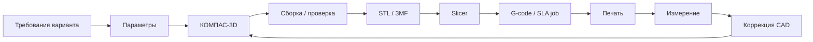

# Лабораторная работа № 3. Параметрическое трехмерное моделирование корпусных узлов и кинематики робота в КОМПАС-3D и подготовка G-кода для FDM/SLA 3D-печати

## 1. Цели, задачи и индикаторы компетенций

**Раздел дисциплины:** «Цифровая печать».  
**Максимальная оценка:** **20 баллов**.

### Цель

Разработать параметрическую CAD-модель механического или корпусного узла сквозного роботизированного образовательного комплекса, подготовить модель к аддитивному производству и подтвердить пригодность конструкции через анализ ориентации, допусков, материала, заполнения и результатов slicing.

### Задачи

1. Преобразовать требования индивидуального варианта в параметры CAD.
2. Создать исходную модель в КОМПАС-3D.
3. При необходимости создать сборку и проверить кинематику/коллизии.
4. Экспортировать STL/3MF.
5. Выбрать ориентацию и технологию печати.
6. Рассчитать/обосновать усадку и допуски.
7. Выполнить slicing.
8. Для FDM получить G-code; для SLA — файл задания совместимого слайсера и отчет параметров.
9. Выполнить размерный анализ готовой или виртуально подготовленной детали.
10. Оформить инженерную документацию в Git.

### Индикаторы компетенций

- **ОПК-2:** проектирует учебную инженерную деятельность на основе CAD и аддитивных технологий.
- **ОПК-9:** применяет САПР, форматы STL/3MF, slicer и средства цифрового производства.
- **УК-1:** анализирует геометрию, нагрузки, допуски, усадку и технологические ограничения.
- **УК-6:** организует итеративный CAD-процесс и документирует версии конструкции.

## 2. Аппаратно-программное обеспечение рабочего места

### Обязательно

- КОМПАС-3D / КОМПАС-3D LT / образовательная лицензия согласно условиям АСКОН;
- slicer, совместимый с доступным 3D-принтером;
- ПК 8 ГБ ОЗУ минимум, 16 ГБ рекомендуется;
- Git;
- измерительный инструмент: штангенциркуль при физической печати.

На 2026 г. АСКОН предоставляет учебные версии КОМПАС-3D и отдельные учебные комплекты для образовательных организаций. В репозитории необходимо указать фактически использованную версию.

### 3D-печать

Допускается:

- FDM/FFF;
- SLA/MSLA при наличии безопасной лабораторной инфраструктуры.

> Для FDM/FFF стандартным выходом обычно является G-code. Для фотополимерных SLA/MSLA-принтеров многие слайсеры формируют **проприетарный файл задания**, а не универсальный G-code. В таком варианте студент прикладывает файл задания, скрин параметров slicing и экспорт таблицы параметров, если это поддерживает ПО.

## 3. Теоретический базис и пошаговый алгоритм выполнения (с листингами кода и настройками ПО)

### 3.1. Параметризация

Не моделируйте размеры как несвязанные константы. Определите набор параметров:

```text
sensor_width = 45 mm
sensor_height = 20 mm
wall = 2.0 mm
hole_d = 3.2 mm
clearance = 0.25 mm
```

Связанные размеры задавайте через выражения.

### 3.2. Усадка

Если ожидаемая линейная усадка материала $s$ выражена долей, простая компенсация размера:

$$
D_{cad} = \frac{D_{target}}{1-s}.
$$

Например, при $D_{target}=50$ мм и $s=0.008$:

$$
D_{cad} \approx 50.40 	ext{ мм}.
$$

Это начальная инженерная оценка; реальная компенсация определяется пробной печатью.

### 3.3. Высота слоя и число слоев

$$
N \approx \frac{H}{h},
$$

где $H$ — высота модели по Z, $h$ — высота слоя.

Сравните минимум два профиля слоя, например 0.20 и 0.12 мм, и оцените изменение числа слоев.

### 3.4. Заполнение и масса

Грубая оценка массы:

$$
m \approx \rho \cdot V_{material},
$$

где $\rho$ — плотность полимера.

Infill влияет на внутренний объем материала, но масса также определяется оболочками, верхними/нижними слоями и поддержками. Поэтому окончательную оценку берите из slicer.

### 3.5. Ориентация

Для каждой модели подготовьте минимум **две ориентации** и сравните:

- support volume;
- время;
- качество критической поверхности;
- направление межслойной нагрузки;
- площадь контакта со столом.

Сводная таблица в отчете:

| Параметр | Orientation A | Orientation B |
|---|---:|---:|
| Время |  |  |
| Масса/расход |  |  |
| Supports |  |  |
| Критическая поверхность |  |  |
| Оценка прочности |  |  |

### 3.6. Параметрические допуски

Для соединений создайте минимум один тест:

```text
nominal 5.00
clearance +0.10
clearance +0.20
clearance +0.30
```

После физической печати измерьте результат. Если принтер недоступен, выполните виртуальный tolerance plan и явно отметьте, что эмпирическая валидация не проведена.

### 3.7. Подготовка STL/3MF

Перед slicing:

1. проверить замкнутость модели;
2. проверить единицы измерения;
3. проверить нормали/геометрию;
4. убедиться, что нет случайных микроскопических тел;
5. зафиксировать имя версии.

Рекомендуемое имя:

```text
v07_wheel_hub_rev02.stl
```

### 3.8. Slicing для FDM

Зафиксируйте:

```text
printer
nozzle_diameter
material
layer_height
perimeters
top_bottom_layers
infill_percent
infill_pattern
print_temperature
bed_temperature
supports
orientation
estimated_time
estimated_material
```

### 3.9. Проверка G-code

Не редактируйте G-code вслепую. Выполните только анализ заголовка и первых команд.

Пример:

```gcode
G28
G90
M82
G1 Z0.20 F1200
G1 X20 Y20 F3000
```

В отчете объясните назначение минимум 5 команд из **фактически сгенерированного** файла.

### 3.10. Кинематика

Если вариант содержит подвижную сборку, задайте:

- ось вращения;
- диапазон угла;
- зазоры;
- запретные пересечения.

Для пары шестерен:

$$
i = \frac{z_2}{z_1}.
$$

Для варианта 22:

$$
i = \frac{32}{16} = 2.
$$

### 3.11. Mermaid-пайплайн



### 3.12. Связь со сквозным кейсом

Модель должна принадлежать тому же образовательному комплексу, что и ЛР № 1–2. В README укажите:

- какой сенсор/привод/контроллер размещается в узле;
- какие кабели/разъемы нужно оставить доступными;
- как деталь влияет на цифровой двойник или телеметрию.

## 4. Таблица 25 индивидуальных вариантов

| Вариант | Объект / Кинематический узел | Технические параметры / Датчики | Требования к реализации / Выходной результат |
|:-------:|:----------------------------|:--------------------------------|:---------------------------------------------|
| 1 | Кронштейн ультразвукового датчика | PLA; стенка 2.0 мм; отверстия M3; infill 25%; компенсация отверстий +0.20 мм | Параметрическая модель; угол установки 0–30°; STL/3MF; FDM G-code; контроль 3 размеров |
| 2 | Кронштейн ToF-датчика | PETG; стенка 2.4 мм; M2.5; infill 30%; усадка 0.5% | Защитить оптическое окно; ребро жесткости; рассчитать масштаб компенсации; STL + G-code |
| 3 | Корпус ESP32 | PLA; зазор крышки 0.30 мм; стенка 2 мм; infill 20% | Корпус из 2 деталей; отверстия USB и вентиляции; сборочный чертеж; STL обеих деталей |
| 4 | Корпус Raspberry Pi Pico W | PETG; защелки; зазор 0.35 мм; infill 25% | Предусмотреть доступ к USB и антенную зону без металлизированных вставок; STL + G-code |
| 5 | Моторный кронштейн TT/DC | PETG; 4 отверстия M3; infill 45%; 4 периметра | Учесть направление нагрузки; печать в 2 ориентациях; выбрать более прочную и обосновать |
| 6 | Кронштейн мотор-редуктора N20 | ABS; расчетная усадка 0.8%; infill 40%; стенка 2.4 мм | Компенсировать усадку; посадка с зазором 0.25 мм; FDM G-code; измерить отклонения |
| 7 | Ступица колеса | PETG; вал 5 мм; внешний Ø28 мм; infill 60% | Параметр вала; две посадки +0.15 и +0.30 мм; напечатать тестовые втулки и выбрать |
| 8 | Колесо робота | TPU; Ø60 мм; ширина 14 мм; infill 20%; 3 периметра | Разработать рисунок протектора; оценить деформацию; STL + G-code; масса детали |
| 9 | Опорный ролик/caster | PLA/PETG; ось M4; колесо Ø25 мм; infill 40% | Сборка минимум из 2 деталей; обеспечить вращение; спецификация крепежа |
| 10 | Двухпальцевый захват-клешня | PETG; 2 пальца; сервопривод; infill 35%; M3 | Параметрическая ширина захвата; проверка коллизий; сборка; STL деталей + G-code |
| 11 | Палец мягкого захвата | TPU; длина 70 мм; стенка 1.6 мм; infill 10–15% | Сделать гибкую геометрию; сравнить 10% и 15% infill; определить рабочий вариант |
| 12 | Сервокронштейн pan | PLA; стандартный micro-servo; M2; infill 30% | Поворот ±90°; задать ось вращения; сборка; проверка пересечений |
| 13 | Сервокронштейн tilt | PETG; micro-servo + камера/датчик; infill 35% | Кинематическая пара; ограничение угла; расчет центра масс приближенно |
| 14 | Панорамный модуль pan-tilt | PLA/PETG; 2 сервопривода; infill 35%; зазор 0.3 мм | Сборка минимум 3 деталей; два угла свободы; explode-view/скрин сборки |
| 15 | Корпус IMU | SLA resin либо PLA; стенка 1.5 мм; отверстия M2 | Для SLA: подготовить ориентацию/supports и файл задания слайсера; для FDM: G-code; сравнить технологии |
| 16 | Корпус датчика тока | PETG; плата INA219/аналог; стенка 2 мм; вентиляция | Развести силовую и сигнальную зоны конструктивно; крышка на винтах; STL + чертеж |
| 17 | Корпус батарейного блока | PETG; 2×18650 макет/держатель; стенка 2.4 мм; infill 30% | Не проектировать контактные элементы; предусмотреть фиксацию готового держателя и кабельный ввод |
| 18 | Кабельная цепь | PETG; звено 20×12 мм; зазор шарнира 0.35 мм | Параметрическое одно звено + сборка из 8 звеньев; проверить минимальный радиус изгиба |
| 19 | Направляющая для проводов | TPU/PLA; 6 каналов Ø3–5 мм; infill 20% | Параметр числа/диаметра каналов; крепление M3; STL + G-code |
| 20 | Переходная плита сенсорного модуля | PLA; 60×40 мм; сетка отверстий; infill 30% | Параметрические шаг и диаметр отверстий; минимум 2 стандарта крепления на одной плите |
| 21 | Корпус редуктора учебного привода | PETG; 2 вала; подшипники/втулки; infill 50% | Сборка корпуса из 2 половин; посадочные места; анализ доступности печати и сборки |
| 22 | Пара шестерен учебного редуктора | PLA; модуль 1; z1=16, z2=32; infill 80% | Рассчитать передаточное отношение; межосевое расстояние; смоделировать пару; STL + G-code |
| 23 | Шкив ременной передачи | PETG; Ø40 мм; вал 5 мм; infill 60% | Параметризовать число/геометрию ручьев или зубьев учебной модели; проверить соосность |
| 24 | Защитный бампер мобильного робота | TPU; толщина 3 мм; infill 12%; ширина 120 мм | Спроектировать зоны деформации; сравнить массу и расчетный ход деформации двух вариантов |
| 25 | Модульный корпус роботизированного комплекса | PETG; 3 секции: controller/power/sensors; infill 25–35% | Сборка минимум 4 деталей; кабельные каналы; сервисный доступ; полный комплект CAD/STL/G-code и BOM |

## 5. Требования к составу артефактов в GitHub-репозитории (исходный код, CAD/STL-файлы, G-код, схемы, README.md)

```text
lab03/
├── README.md
├── cad/
│   ├── source/
│   └── screenshots/
├── export/
│   ├── model.stl
│   └── model.3mf        # если используется
├── print/
│   ├── model.gcode      # FDM
│   └── sla_job.*        # если применимо
├── docs/
│   ├── dimensions.md
│   ├── slicing.md
│   ├── tolerance.md
│   └── analysis.md
└── media/
    └── result.jpg       # при физической печати
```

Обязательно:

- исходный CAD-файл;
- STL/3MF;
- G-code для FDM либо файл задания SLA;
- 2 скриншота разных ориентаций;
- таблица slicing;
- расчет усадки/допуска;
- минимум 3 контрольных размера;
- связь с узлом сквозного роботизированного комплекса.

Не добавляйте в Git большие автоматически генерируемые файлы, если политика репозитория это запрещает; в таком случае приложите хеш и инструкцию воспроизведения.

## 6. Детализированный критериальный рубрикатор (Строго 20 баллов)

| Критерий | Детализация | Баллы |
|---|---|---:|
| **Работоспособность и корректность программно-аппаратного/CAD решения** | CAD геометрически корректен — 2; сборка/кинематика/посадки проверены — 2; slicing и производственный файл формируются — 2 | **6** |
| **Точность реализации параметров индивидуального варианта** | Материал и размеры — 2; infill/усадка/допуски — 2; все специальные требования варианта — 1 | **5** |
| **Инженерно-методическая оптимизация и анализ результатов** | Сравнение ориентаций — 1; анализ supports — 1; расчет/измерение — 1; итерация CAD — 1; обоснование применения детали в учебном роботе — 1 | **5** |
| **Оформление репозитория, воспроизводимость инструкций, защита отчета** | Исходники и экспорты — 1; README — 1; таблицы/скриншоты — 1; защита модели и ответ на вопросы — 1 | **4** |
| **Итого** |  | **20** |
