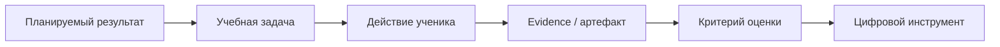
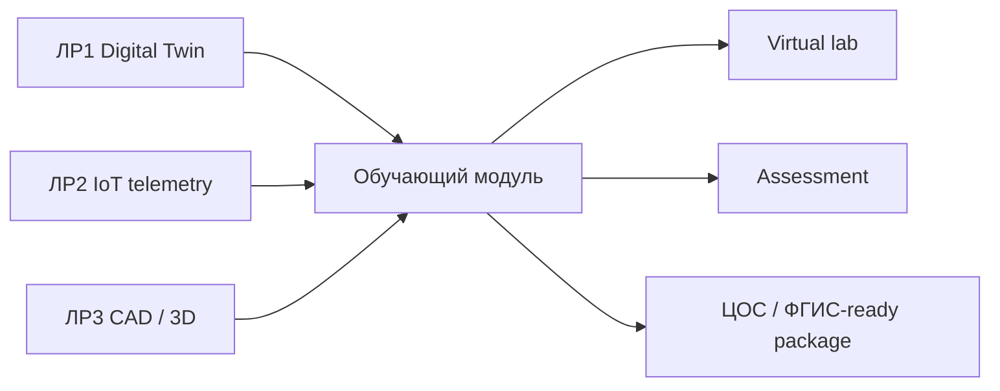

# Лабораторная работа № 4. Проектирование интерактивного цифрового обучающего модуля по робототехнике и виртуального практикума для интеграции в ЦОС / ФГИС «Моя школа»

## 1. Цели, задачи и индикаторы компетенций

**Раздел дисциплины:** «Цифровые технологии в образовании».  
**Максимальная оценка:** **20 баллов**.

### Цель

Спроектировать цифровой учебный модуль по робототехнике, который связывает образовательный результат, интерактивную модель/симулятор, самостоятельную деятельность обучающегося, формирующее оценивание и инженерные артефакты сквозного роботизированного комплекса.

### Задачи

1. Выбрать образовательный результат для заданной возрастной группы.
2. Сформулировать измеримые цели.
3. Разработать сценарий `теория → демонстрация → симуляция → задание → проверка → рефлексия`.
4. Подготовить виртуальный практикум в Webots/Tinkercad или эквивалентной среде.
5. Создать систему оценивания.
6. Подготовить метаданные и структуру ресурса для размещения в ЦОС.
7. Обеспечить доступность альтернативного сценария, если внешний сервис недоступен.
8. Связать модуль с результатами ЛР № 1–3.

### Индикаторы компетенций

- **ОПК-2:** проектирует содержание, деятельность и оценивание цифрового учебного модуля.
- **ОПК-9:** применяет ЦОС, симуляторы, Git и цифровые образовательные ресурсы.
- **УК-1:** критически оценивает педагогическую целесообразность технологии и данные обучающегося.
- **УК-6:** планирует разработку, версионирование, публикацию и защиту образовательного продукта.

## 2. Аппаратно-программное обеспечение рабочего места

### Базовый стек

- ПК 8 ГБ ОЗУ;
- браузер;
- Git;
- Markdown-редактор;
- Python 3.10+ для вариантов с анализом данных/контроллерами;
- Webots — для робототехнической симуляции;
- Tinkercad Circuits — как дополнительная облачная среда для электронных схем;
- КОМПАС-3D/slicer — для вариантов с CAD;
- локальная или вузовская ЦОС/LMS.

> Tinkercad является внешним облачным сервисом. Для обязательного задания студент должен предусмотреть резерв: скриншоты, видео, starter-код, локальный эмулятор либо готовый dataset, чтобы прохождение модуля не зависело исключительно от доступности внешней платформы.

### Интеграция с ФГИС «Моя школа»

В рамках лабораторной **не требуется программный доступ к закрытым API ФГИС**. Студент проектирует ресурс, готовый к размещению/связыванию в цифровой образовательной среде:

- название;
- аннотация;
- возраст;
- планируемые результаты;
- инструкция;
- ссылка/файл интерактива;
- оценочные материалы;
- требования к оборудованию;
- безопасность;
- альтернативный сценарий.

Фактический способ публикации в ФГИС зависит от полномочий образовательной организации и доступных ей интерфейсов.

## 3. Теоретический базис и пошаговый алгоритм выполнения (с листингами кода и настройками ПО)

### 3.1. Проектирование от результата

Запрещенный подход:

```text
«Возьмем Webots, потому что он интересный, и потом придумаем тему».
```

Правильная последовательность:



### 3.2. Формулировка результата

Используйте наблюдаемые действия:

Плохо:

> Ученик знает датчики.

Лучше:

> Ученик объясняет роль датчика расстояния, считывает его значение в симуляторе и изменяет условие остановки робота, проверяя результат на трех расстояниях.

### 3.3. Структура модуля

Обязательные блоки:

```text
1. Тема
2. Для кого
3. Результат
4. Предварительные знания
5. Краткая теория
6. Демонстрация
7. Виртуальный эксперимент
8. Самостоятельное задание
9. Автопроверка/чек-лист
10. Контрольные вопросы
11. Рефлексия
12. Дополнительный уровень
```

### 3.4. Метаданные

Создайте `metadata.json`:

```json
{
  "title": "Условный оператор и датчик расстояния",
  "audience": "7–9 классы",
  "duration_min": 45,
  "subject": "Информатика / робототехника",
  "tools": ["Webots", "Python"],
  "learning_outcomes": [
    "считывать значение датчика",
    "использовать условный оператор",
    "проверять алгоритм экспериментом"
  ],
  "artifacts": [
    "controller.py",
    "experiment.csv",
    "reflection.md"
  ]
}
```

### 3.5. Webots: минимальный Python-контроллер

```python
from controller import Robot

robot = Robot()
timestep = int(robot.getBasicTimeStep())

left = robot.getDevice("left wheel motor")
right = robot.getDevice("right wheel motor")

left.setPosition(float("inf"))
right.setPosition(float("inf"))

sensor = robot.getDevice("distance sensor")
sensor.enable(timestep)

while robot.step(timestep) != -1:
    value = sensor.getValue()

    if value > 800:
        left.setVelocity(0.0)
        right.setVelocity(0.0)
    else:
        left.setVelocity(3.0)
        right.setVelocity(3.0)
```

Имена устройств зависят от конкретного Webots world; starter-проект должен содержать корректную сцену.

### 3.6. Tinkercad/Arduino: пример

```cpp
const int sensorPin = A0;
const int ledPin = 9;

void setup() {
  Serial.begin(9600);
  pinMode(ledPin, OUTPUT);
}

void loop() {
  int value = analogRead(sensorPin);

  int pwm = map(
    value,
    0, 1023,
    0, 255
  );

  analogWrite(ledPin, pwm);
  Serial.println(value);

  delay(100);
}
```

Обучающий модуль должен попросить ученика **изменить параметр и проверить гипотезу**, а не просто скопировать код.

### 3.7. Автопроверка простого артефакта

Пример для Python:

```python
def stop_rule(distance_cm: float) -> str:
    if distance_cm < 20:
        return "STOP"
    return "GO"

def test_stop_rule():
    assert stop_rule(10) == "STOP"
    assert stop_rule(19.9) == "STOP"
    assert stop_rule(20) == "GO"
    assert stop_rule(50) == "GO"
```

### 3.8. Формирующее оценивание

Минимум:

- 5 контрольных вопросов;
- 1 практическое задание;
- критерии выполнения;
- обратная связь для типичной ошибки;
- дополнительное задание повышенной сложности.

### 3.9. Доступность

Проверьте:

- понятность инструкции без устного пояснения;
- подписи к рисункам;
- контраст;
- отсутствие информации, передаваемой только цветом;
- альтернативу видео/симулятору;
- размер кода и читаемость;
- доступность файлов без регистрации там, где возможно.

### 3.10. Педагогические данные

Не собирайте лишние персональные данные.

Для учебной аналитики достаточно обезличенных событий:

```json
{
  "student_code": "anon-17",
  "activity": "webots_task_2",
  "attempt": 2,
  "result": "passed",
  "duration_sec": 413
}
```

### 3.11. Связь четырех лабораторных

Финальный модуль должен использовать минимум **два** результата предыдущих работ:

- FSM/цифровой двойник ЛР № 1;
- MQTT/телеметрию ЛР № 2;
- CAD/STL/G-code ЛР № 3.

Для варианта 25 — все три.



### 3.12. Порядок выполнения

1. Получить вариант.
2. Определить возраст и место темы в программе.
3. Сформулировать 2–4 результата.
4. Разработать карту модуля.
5. Создать/адаптировать симуляцию.
6. Создать starter-артефакты.
7. Разработать задания и rubric.
8. Провести мини-апробацию на 1–2 пользователях или self-review по чек-листу.
9. Исправить минимум 3 выявленные проблемы.
10. Подготовить публикационный пакет.

## 4. Таблица 25 индивидуальных вариантов

| Вариант | Объект / Кинематический узел | Технические параметры / Датчики | Требования к реализации / Выходной результат |
|:-------:|:----------------------------|:--------------------------------|:---------------------------------------------|
| 1 | 5–6 классы: «Алгоритм движения робота в лабиринте» | Webots; последовательность, ветвление; 6–8 шагов; без сложной физики | Интерактивный сценарий + симуляция; 5 заданий; итог: алгоритм и скрин траектории |
| 2 | 5–6 классы: «Датчик как источник данных» | Tinkercad Circuits; Arduino + фоторезистор + LED | Модуль объясняет аналоговый ввод; 3 эксперимента с порогом; тест 5 вопросов |
| 3 | 5–6 классы: «Координаты мобильного робота» | Webots; плоскость X–Y; движение по 4 точкам | Ученик задает маршрут; вывод координат; задание на чтение траектории |
| 4 | 5–6 классы: «Светофор как конечный автомат» | Tinkercad; Arduino; 3 LED + кнопка | FSM из 3–4 состояний; схема + код; интерактивная проверка последовательности |
| 5 | 5–6 классы: «Безопасное поведение робота» | Webots; датчик расстояния; простое условие | Робот должен остановиться перед препятствием; 3 значения порога; рефлексия о безопасности |
| 6 | 7–9 классы: «Линейные алгоритмы и исполнитель» | Webots; differential drive; Python | Контроллер движения по квадрату; параметры скорости/времени; автопроверка 4 участков |
| 7 | 7–9 классы: «Условный оператор и датчик расстояния» | Webots; proximity sensor; Python | Алгоритм объезда одного препятствия; лог sensor/action; 5 контрольных вопросов |
| 8 | 7–9 классы: «Циклы в робототехнике» | Webots; Python; 5 контрольных точек | Использовать цикл вместо копирования команд; сравнить две реализации по длине кода |
| 9 | 7–9 классы: «Массив датчиков линии» | Webots/локальный симулятор; 5 ИК-каналов | Интерпретировать массив 0/1; вычислять ошибку положения; таблица 8 сенсорных ситуаций |
| 10 | 7–9 классы: «Arduino: управление яркостью» | Tinkercad; Arduino; PWM LED + потенциометр | АЦП→PWM; график вход/выход; объяснить квантование и масштабирование |
| 11 | 7–9 классы: «Умный кабинет» | Tinkercad; температура + освещение; Arduino | Два пороговых правила; журнал 10 измерений; схема сенсор→алгоритм→актуатор |
| 12 | 7–9 классы: «MQTT и телеметрия робота» | Webots + локальный MQTT либо подготовленный набор данных | Показать topic/payload; анализ 20 JSON-сообщений; без обязательного внешнего облака |
| 13 | 7–9 классы: «3D-модель детали робота» | КОМПАС-3D + просмотр STL; кронштейн датчика | Параметрическая модель по 5 размерам; объяснить CAD→STL→печать; мини-тест |
| 14 | 7–9 классы: «От симуляции к реальному роботу» | Webots + видео/данные физического стенда | Сравнить 3 расхождения sim-to-real; заполнить таблицу причина→эксперимент |
| 15 | 10–11 классы: «Пропорциональное управление движением» | Webots; Python; датчик расстояния | Реализовать P-регулятор; исследовать Kp в 3 значениях; график ошибки |
| 16 | 10–11 классы: «PID-регулятор линии» | Webots; sensor array; Python | Реализовать P/PI/PID по уровню группы; сравнить перерегулирование и время |
| 17 | 10–11 классы: «Обработка телеметрии» | Python/Jupyter; CSV из ЛР №2 | pandas; среднее, медиана, выбросы; 2 графика; педагогическая интерпретация |
| 18 | 10–11 классы: «Цифровой двойник робота» | Python + JSON + Webots | Связать state/sensors/actuators; FSM; интерактивная таблица переходов |
| 19 | 10–11 классы: «IoT-архитектура и безопасность» | MQTT-схема; dashboard; без открытого broker | Спроектировать topics/ACL; найти 5 рисков; мини-кейс с разрывом связи |
| 20 | 10–11 классы: «Аддитивное производство» | КОМПАС-3D + slicer; PLA/PETG | Сравнить 2 ориентации; расчет числа слоев; анализ supports и массы |
| 21 | СПО: «Мобильный робот и архитектура ПО» | Webots; Python; модульная структура controller/sensors/fsm | Разделить драйверы и алгоритм; unit-тест логики; технический отчет |
| 22 | СПО: «ESP32 MQTT telemetry» | ESP32 либо dataset-emulator; Mosquitto; Python subscriber | Полный канал publish/subscribe; dashboard; JSON schema; анализ QoS |
| 23 | СПО: «Параметрическое проектирование корпуса» | КОМПАС-3D; корпус платы; FDM | CAD/STL/G-code; tolerance plan; 3 контрольных размера; инженерная документация |
| 24 | СПО: «Диагностика робототехнической системы» | Webots/телеметрия; faults dataset | Найти 4 типа отказов по логам; построить алгоритм диагностики; оформить decision tree |
| 25 | СПО/10–11: «Интегрированный цифровой проект» | Webots + MQTT + CAD/3D + Git | Итоговый модуль объединяет симуляцию, телеметрию и корпус узла; rubric + портфолио + защита |

## 5. Требования к составу артефактов в GitHub-репозитории (исходный код, CAD/STL-файлы, G-код, схемы, README.md)

```text
lab04/
├── README.md
├── module/
│   ├── module.md
│   ├── metadata.json
│   ├── teacher_guide.md
│   └── student_guide.md
├── simulation/
│   ├── webots/
│   └── tinkercad_link_or_backup.md
├── starter/
│   └── ...
├── assessment/
│   ├── questions.md
│   ├── rubric.md
│   └── tests/
├── previous_labs/
│   └── integration.md
├── accessibility/
│   └── checklist.md
└── media/
    └── screenshots/
```

Если модуль использует CAD/STL/G-code из ЛР № 3, не дублируйте тяжелые файлы без необходимости: допускается относительная ссылка на каталог `lab03/`.

README должен содержать:

- вариант и целевую аудиторию;
- планируемые результаты;
- длительность;
- необходимые устройства/ПО;
- запуск виртуального практикума;
- резервный сценарий;
- критерии оценивания;
- связь с ФОП/рабочей программой на уровне темы и результата;
- рекомендации преподавателю;
- ограничения и безопасность.

## 6. Детализированный критериальный рубрикатор (Строго 20 баллов)

| Критерий | Детализация | Баллы |
|---|---|---:|
| **Работоспособность и корректность программно-аппаратного/CAD решения** | Виртуальная практика запускается — 2; starter/код/данные работоспособны — 2; итоговое задание и проверка выполняются — 2 | **6** |
| **Точность реализации параметров индивидуального варианта** | Возраст/тема/симулятор соблюдены — 2; все технические параметры варианта — 2; требуемый выходной продукт — 1 | **5** |
| **Инженерно-методическая оптимизация и анализ результатов** | Результат→деятельность→оценка согласованы — 1; есть эксперимент — 1; интеграция прошлых ЛР — 1; доступность/резерв — 1; анализ апробации и исправлений — 1 | **5** |
| **Оформление репозитория, воспроизводимость инструкций, защита отчета** | Полная структура — 1; README/teacher guide — 1; метаданные и media — 1; защита педагогического решения — 1 | **4** |
| **Итого** |  | **20** |
